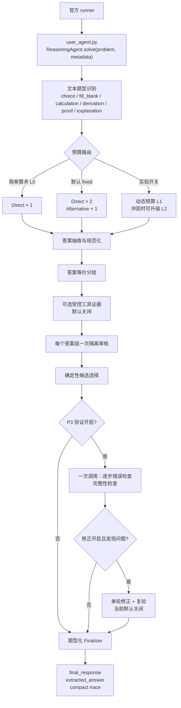

# Challenge Cup 2026 数学推理智能体

本仓库是挑战杯 2026 人工智能赛道初赛的参赛实现，已经从官方 naive baseline
演进为一个受调用预算约束的数学推理智能体。系统围绕题型识别、异构候选生成、
答案抽取与分组审核、证据裁决、P3 逐步验证和题型化输出构建，同时保持赛事规定的
单文件入口与公开 client 契约。

> 当前状态（2026-08-02）：P0-P3.1 已完成实现和本地验收，当前工作区
> `153/153` 项单元测试通过。异构 Reasoner 与 P3 已实现，但尚未完成同一评测窗口下
> 的四组双轮 A/B，因此“已实现”不等于“已证明能提升官方分数”。

## 当前 Agent 架构

当前系统是“确定性 Python Harness + 受调用预算约束的模型推理”，不是由多个常驻
子 Agent 组成的分布式系统。`ReasoningAgent` 在每次 `solve()` 中创建并维护本题的
候选、证据、预算和 trace；调用结束后不保留跨题状态，也不使用 `metadata` 中的题号、
学科或答案信息。



各层职责如下：

| 层 | 当前实现 | 默认行为 |
| --- | --- | --- |
| 入口与编排 | `ReasoningAgent.solve()`；每题独立维护状态 | 官方只需构造 `ReasoningAgent(client=...)` |
| 题型识别 | 基于题面文本的通用规则，不读取 `metadata` | 开启，生成题型对应的输出提示 |
| 候选生成 | `DirectReasoner` 使用定义—定理—正向推导；`AlternativeReasoner` 使用反证、构造、边界或数值/代数交叉检查 | 非 L0 为 `2 Direct + 1 Alternative`；两者是同一 client 的互补提示，不是独立常驻 Agent |
| 答案处理 | 抽取、占位符拒绝、数值/无序多根集合规范化、仅对可证明等价项分组 | 开启 |
| 审核与裁决 | 每个答案组一次隔离 LLM 审核；结合受控工具证据、组内共识、审核结果和候选 ID 确定性选择 | LLM 分组审核开启；工具证据关闭 |
| P3 | 对最终候选一次性执行逐步错误检查和完整性检查 | 验证开启，修正关闭 |
| 输出 | 选择/填空返回紧凑答案；其他题型保留完整解答 | 返回 `final_response`、本地评测用 `extracted_answer` 和紧凑 `trace` |

### 当前能力

- 识别计算、选择、填空、证明、推导和解释六种输出题型。
- 简单算术走 L0 单次 Direct 路径；其他题默认使用 `2 Direct + 1 Alternative`
  生成互补候选。候选生成和审核共享本题调用预算。
- 保守抽取最终答案，支持数值、多根集合、方程、区间、向量、矩阵及非数值长答案。
- 对可证明等价的答案分组，每组只进行一次隔离上下文审核。
- 按受控工具证据、答案共识、审核结果和固定候选 ID 进行确定性选择。
- P3 合并执行逐步错误检查和完整性检查；验证器异常、截断或协议畸形不会被当成通过。
- evaluator 支持三态 AnswerJudge、P95、Judge coverage、P3 状态统计、有效调用上限和
  紧凑预测答案保存。
- 所有单题状态仅在一次 `solve()` 内存在，不依赖题目顺序、进程复用或隐藏答案。

当前默认开启异构 Reasoner 和 P3 验证，但关闭 P3 修正。修正路径仍有一个已知的
fail-open 边界：复验 `skipped`、`inconclusive` 或无剩余预算时会保留修正答案。
因此在改为 fail-closed 并完成 A/B 前，不应在正式提交路径启用
`enable_step_revision=True`。

## 求解流程与边界

正式内核使用普通 Python 状态机，没有引入 LangGraph、AgentScope 或联网工具。模型只
负责生成候选解答、审核候选组，以及在显式开启时执行验证/修正；代码负责题型路由、
调用/时间预算、答案解析、等价分组、证据范围、确定性选择、终止和降级。

`sympy_adapter.py` 是默认关闭的受控实验，并且当前只对简单算术题面提供工具证据；
stdio MCP、离线定理卡 RAG 和复杂能力冻结集仍属于后续阶段，不是当前运行时依赖。

每题的时间保护为：默认约 16 分钟后停止新增候选，约 18 分钟后停止发起新的模型调用；
这是应用层保护，不能替代官方单题 20 分钟限制。

## 默认配置

> P0 止血版本（2026-08-13）：官方评测曾因 1024 token 截断 + 末行兜底抽取把一题放大到约 7 次调用，触发系统负载终止。默认路径已压缩为单次主调用 + 最多一次条件重试，token 上限 4096（2026-08-15 由 3072 晋升：官方隐藏集上 3072 截断率高达 91.7%、准确率仅 4.46%，4096 在冻结集配对 A/B 中显著降低 length 与 thinking 泄漏且无准确率回退），关闭审核、异构与 P3。

| 配置 | 默认值 | 说明 |
| --- | --- | --- |
| `policy_sample_times` | `1` | 主求解调用次数 |
| `verifier_voting_times` | `0` | 每个答案组的审核次数（关闭） |
| `max_model_calls` | `2` | 基础模型调用上限（1 主调用 + 至多 1 条件重试） |
| `max_tokens` | `4096` | 非 L0 生成上限 |
| `l0_max_tokens` | `4096` | L0 生成上限 |
| `verifier_max_tokens` | `256` | 答案组审核生成上限；P3 验证使用独立固定预算 |
| `enable_task_aware_prompt` | `True` | 使用题型化输出提示 |
| `enable_l0_extended_tokens` | `True` | 允许简单算术进入 L0 路径 |
| `enable_time_convergence` | `True` | 启用每题 16/18 分钟收敛与硬停止保护 |
| `enable_heterogeneous_reasoners` | `False` | 异构 Reasoner（关闭） |
| `enable_step_verification` | `False` | P3 验证（关闭） |
| `enable_step_revision` | `False` | P3 修正（关闭） |
| `p3_call_boost` | `3` | P3 开启后基础上限增加 3 |
| `enable_l2_routing` | `False` | 实验路由 |
| `enable_sympy_evidence` | `False` | 受控 SymPy 实验 |
| `enable_dynamic_budget` | `False` | 动态预算实验 |
| `enable_local_repair` | `False` | 局部修复实验 |
| `enable_uncertain_repair` | `False` | uncertain 修复实验 |
| `enable_deterministic_solver` | `False` | 隔离的确定性数学求解器实验；unsupported 时回退模型 |
| `enable_method_rag` | `False` | 40 张离线方法卡 RAG 实验；未通过模型 A/B 前保持关闭 |

## 赛事接口

仓库根目录的 `user_agent.py` 导出：

```python
from user_agent import ReasoningAgent

agent = ReasoningAgent(client=official_client)
result = agent.solve(problem, metadata)
```

返回值是可 JSON 序列化的字典，并始终包含非空字符串 `final_response`：

```json
{
  "final_response": "最终答案或完整证明",
  "extracted_answer": "用于本地评测的紧凑答案",
  "trace": [
    {"step": "route_budget", "level": "fixed", "max_model_calls": 9},
    {"step": "finalize", "status": "selected", "model_calls": 7}
  ]
}
```

智能体只依赖公开模型调用契约：

```python
client.chat(messages=messages, temperature=temperature, max_tokens=max_tokens)
```

代码不访问 client 私有字段，不读取样例 `answer`，不依赖本地绝对路径，也不在 trace
中保存完整 Prompt、冗长模型原文或敏感信息。正式评分主要依据 `final_response`；
`extracted_answer` 只用于本仓库的本地 evaluator。

## 快速开始

建议使用 Python 3.10+。

```powershell
python -m venv .venv
.\.venv\Scripts\Activate.ps1
python -m pip install -r requirements.txt
```

本地调用需要配置书生 API：

```powershell
$env:INTERN_API_KEY = "your-api-key"
# 可选：$env:INTERN_MODEL = "intern-s2-preview-397b"
# 397B 长推理本地诊断可先设置：$env:INTERN_TIMEOUT_SECONDS = "120"
```

运行 3 道快速冒烟题：

```powershell
python main.py --input_file sample_data/dev.jsonl --output_dir sample_outputs
```

`main.py` 会为每道题生成独立 JSON 文件。正式评测不会把标准答案传给 `solve()`。

## 本地评测

冻结的 `public_regression_112.jsonl` 覆盖 18 个数学方向，但 112 题当前都会被分类为
`calculation`。它适合检查知识覆盖、解析、调用预算和输出链路，不能代表隐藏评测分布，
也不能单独验证证明、推导、长条件、跨方向混合题或 P3 修正能力。

运行当前默认路径：

```powershell
python -m scripts.evaluate_dev `
  --input-file sample_data/public_regression_112.jsonl `
  --validate-regression-dataset `
  --output-file docs/eval_current.json `
  --save-answers-to docs/eval_current_answers.jsonl
```

常用消融配置：

```powershell
# A：同 Prompt 采样，不启用 P3
python -m scripts.evaluate_dev --disable-heterogeneous --disable-step-verification --disable-step-revision --output-file docs/eval_a.json

# B：异构 Reasoner，不启用 P3
python -m scripts.evaluate_dev --enable-heterogeneous --disable-step-verification --disable-step-revision --output-file docs/eval_b.json

# C：异构 Reasoner + P3 验证，不启用修正
python -m scripts.evaluate_dev --enable-heterogeneous --enable-step-verification --disable-step-revision --output-file docs/eval_c.json
```

D 组“异构 + P3 验证和修正”必须先修复复验 fail-open，再用于正式对照。每组至少运行
两轮，并共同报告准确率、题型宏平均、平均/P95 调用数、平均/P95 延迟、超时率、
空响应率、Judge coverage、UNKNOWN 比例和 P3 状态分布。

本地 AnswerJudge 当前支持：

1. 规范化后的精确一致；
2. 选择项和结构化有理数一致，例如 `1/2` 与 `0.5`；
3. 无法可靠判断时返回 `UNKNOWN`，不猜测正确或错误。

它不等同于官方 judger。集合、区间、矩阵和一般符号表达式的完整等价判定仍待后续
受控工具接入。

## 测试与提交前检查

```powershell
python -m unittest discover -s tests -v
python -m py_compile user_agent.py llm_client.py sympy_adapter.py main.py scripts/evaluate_dev.py
git diff --check
```

当前验收基线为 `153/153` 项测试通过。提交前还应确认：

- `user_agent.py` 可正常 import；
- `ReasoningAgent(client=official_client)` 可初始化；
- client 请求失败时仍返回可序列化且非空的 `final_response`；
- `requirements.txt` 包含全部运行时依赖；
- 仓库没有 API key、个人路径、临时输出和样例答案特判；
- 实际提交配置与 A/B 报告中的配置一致。

## 数据与目录

```text
user_agent.py                         # 官方入口与当前求解内核
llm_client.py                          # 本地官方 client 兼容实现
sympy_adapter.py                       # 默认关闭的受控 SymPy 实验
main.py                                # 本地逐题 runner
scripts/evaluate_dev.py                # 本地 evaluator 与消融 CLI
sample_data/dev.jsonl                  # 3 题快速冒烟集
sample_data/public_regression_112.jsonl # 112 题短题知识覆盖集
tests/                                 # 单元与回归测试
TODO_LIST.md                           # 当前路线、Gate 和证据边界
docs/                                  # 技术方案、开发记录与评测报告
```

样例数据中的 `answer` 只允许 evaluator 在本地评分时读取。求解逻辑不得使用题号、
固定题面、样例答案或本地标签进行特判。

## 当前路线

- **已完成**：题型识别、异构 Reasoner、P3-lite 验证/可选修正、P3.1 evaluator
  可信度修复。
- **下一步**：修复 P3 修正复验 fail-open；建立 40-60 题复杂能力冻结集；完成
  A/B/C/D 四组双轮评测并决定默认晋升配置。
- **后续**：按证据接入受控本地工具、离线定理卡 RAG，再考虑进一步模块化。
- **暂不引入**：正式运行时 LangGraph、AgentScope、Lean 4、HTTP MCP、联网工具或
  任意 Python/Shell 执行。

详细设计和开发证据见：

- [TODO_LIST.md](TODO_LIST.md)
- [技术文档](<docs/技术文档(2).md>)
- [系统方案文档](<docs/系统方案文档(2).md>)
- [开发记录](docs/开发记录.md)
- [P1.5 迁移总结](docs/p1_5/p1_5_migration_summary.md)

## 官方提交

赛事特有规则以[飞书赛事文档](https://aicarrier.feishu.cn/wiki/L90FwD9gJiqdg0k33RCcHTdcnrb)
为准。根据 2026-07-16 更新，评测拉取作品已关联仓库的最新 `main` 分支，不再使用
提交固定 commit SHA 的旧流程。

1. 将可复现版本推送到队伍 AtomGit 组织仓库的 `main` 分支。
2. 在 AtomGit 作品页面关联仓库并点击“提交作品”。
3. 平台在北京时间每日 12:00 与 24:00 的固定窗口拉取最新 `main` 进行评测。

提交、推送和作品页面操作都应单独确认。本地数据集结果只用于研发，不代表正式成绩。
