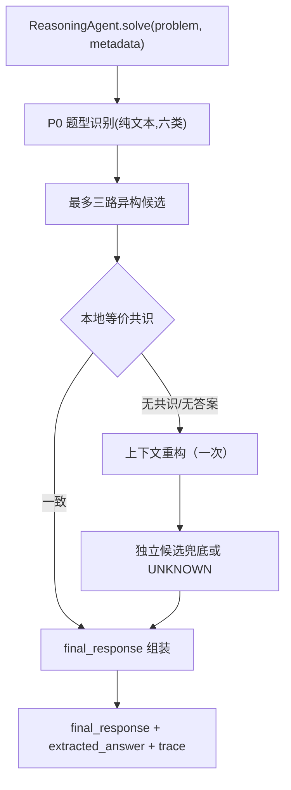
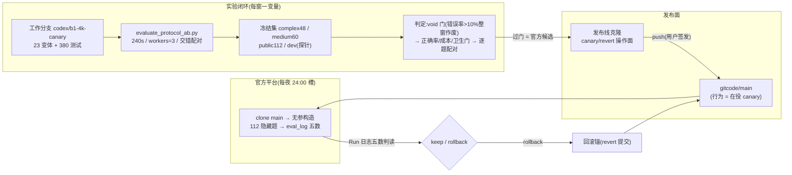

# Challenge Cup 2026 数学推理智能体

本仓库是挑战杯 2026 人工智能赛道初赛的参赛实现:一个受调用预算约束的数学
推理智能体。当前默认流水线为题型识别 → 异构候选求解 → 条件性上下文重构 →
规范化输出，同时保持赛事规定的单文件入口与公开
client 契约。

> 当前状态（2026-09-03）：默认提交路径已切换为
> `contextual_answer_reconstruction_v1`。该方法尚未完成真实能力验证；
> `SUBMISSION_CONFIG` 已开启，RAG、工具、MCP、旧 BTCS/KCV/PS-C/V5 路径保持关闭。

## 当前 Agent 架构

系统是"确定性 Python Harness + 受调用预算约束的模型推理":每题 `solve()`
内独立维护候选、预算与 trace,无跨题状态,不读取 `metadata` 中的答案信息。



| 层 | 在役实现 | 备注 |
| --- | --- | --- |
| 题型识别 | 纯文本规则六分类,不读 metadata | 常开 |
| 生成 | 异构 Direct/Alternative 候选 | 复杂题最多3个候选 |
| 选择 | 本地等价共识；无共识时上下文重构 | 重构响应必须重新显式给答案 |
| 预算 | 每题最多5次模型调用 | 候选4096，重构≤4096 tokens |
| 表示 | numeric 规范化；非数值正文重建 | `UNKNOWN` fail-closed |
| 输出 | `final_response` 非空保证;失败路径返回兜底句 | trace 仅记决策摘要 |

### Contextual Answer Reconstruction 默认路径

官方无参构造现在使用最多三路异构候选；只有候选无共识或无法解析时，
才把受限草稿交给一次上下文重构。重构失败后保留最后一条独立候选，
否则 `UNKNOWN` fail-closed。

## 项目架构与发布流



## 项目目录结构

```text
├── user_agent.py                        # Agent 核心:ReasoningAgent + 全部实验开关
├── llm_client.py                        # 书生 API client(本地评测用)
├── main.py                              # 本地逐题 runner
├── scripts/
│   ├── evaluate_protocol_ab.py          # 实验主力 runner:23 变体/交错配对/void 熔断
│   └── evaluate_dev.py                  # 单配置 evaluator 与消融 CLI
├── sample_data/
│   ├── dev.jsonl                        # 3 题冒烟集
│   ├── public_regression_112.jsonl      # 112 题短题知识覆盖集(回归保护)
│   ├── medium_capability_freeze_60.jsonl
│   └── complex_capability_freeze_48.jsonl
├── tests/                               # 442 项单测(默认路径 + BTCSv2 backport)
├── docs/
│   ├── excluded_approaches.md           # 淘汰方案单一事实源(七条死线)
│   ├── research/                        # 候选依据:能力/评测方法研究 + 采纳报告
│   ├── experiments/                     # 本地与官方评测报告与工件(78+)
│   ├── adr/                             # 关键决策记录
│   ├── agents/                          # 工作流约定
│   └── branches_map.md                  # 分支与发布面地图
├── method_cards.jsonl 等                 # 已归档实验的离线资产(对应开关默认关)
└── tmp/                                 # 未归档原始工件(untracked)
```

## 提交配置与实验开关板

官方 runner 以 `ReasoningAgent(client=official_client)` 无参构造，解析到
`SUBMISSION_CONFIG`：`contextual_answer_reconstruction_v1`，最多5次调用、
4096 token候选/重构；RAG、工具、MCP、refine、salvage 和 SymPy 保持关闭。

| 开关 | 在役 | 说明 |
| --- | --- | --- |
| `enable_contextual_answer_reconstruction` | ✅ | 当前默认路径，尚未能力验证 |
| `enable_adaptive_voting`(k5/threshold3) | ⬜ | 被新路径替代 |
| `enable_heterogeneous_reasoners` | ✅ | 新路径候选生成 |
| `enable_step_verification` / `enable_step_revision` | ⬜ | refine 已撤下 |
| `enable_answer_dual_form`(ARH) | ⬜ | 默认关闭 |
| `enable_gsa_aggregation`(GSA) | ⬜ | 回滚锚 `e9df37e` |
| `enable_numeric_chain_of_draft`(CoD) | ⬜ | ARCHIVED |
| `enable_re2_reread`(Re2) | ⬜ | ARCHIVED(官方回滚) |
| `enable_failure_salvage`(P1) | ⬜ | ARCHIVED |
| `enable_verification_gated_retry`(B1) | ⬜ | 被投票路径替代 |
| `enable_method_rag` | ⬜ | 永久排除(双轮双负) |

## 赛事接口

仓库根目录的 `user_agent.py` 导出:

```python
from user_agent import ReasoningAgent

agent = ReasoningAgent(client=official_client)
result = agent.solve(problem, metadata)
```

返回值是可 JSON 序列化的字典,并始终包含非空字符串 `final_response`。
智能体只依赖公开模型调用契约 `client.chat(messages, temperature, max_tokens)`;
不访问 client 私有字段,不读取样例 `answer`,不依赖本地绝对路径,trace 不保存
完整 Prompt、冗长模型原文或敏感信息。

## 快速开始

建议使用 Python 3.10+。

```powershell
python -m venv .venv
.\.venv\Scripts\Activate.ps1
python -m pip install -r requirements.txt
```

本地调用需要配置书生 API:

```powershell
$env:INTERN_API_KEY = "your-api-key"
# 可选:$env:INTERN_MODEL = "intern-s2-preview-397b"
```

运行 3 道快速冒烟题:

```powershell
python main.py --input_file sample_data/dev.jsonl --output_dir sample_outputs
```

## 本地评测与实验纪律

- **主力 runner**:`scripts/evaluate_protocol_ab.py`(多臂交错配对、240s 超时、
  连续失败熔断、逐题诊断)。筛选窗一律**预注册**:门槛与 void 门
  (任一臂错误率 >10% 整窗作废)在运行前冻结。
- 判定顺序:void 门 → 正确率门 → 成本门 → 卫生门 → 逐题配对差分。
- 本地 AnswerJudge 为保守三态(精确一致/结构化有理数一致/UNKNOWN),不等同
  官方 judger;报告口径含平均/P95 调用、completion tokens、墙钟、invalid 与
  正确数并列。

## 测试与提交前检查

```powershell
python -m unittest discover -s tests -q
python -m py_compile user_agent.py llm_client.py sympy_adapter.py main.py scripts/evaluate_dev.py
```

提交前还应确认:`user_agent.py` 可正常
import;`ReasoningAgent(client=official_client)` 可初始化;client 失败时仍返回
可序列化非空 `final_response`;仓库无 API key、个人路径与样例答案特判;实际
提交配置与 A/B 报告中的配置一致。

## 当前路线

- **在役**：`contextual_answer_reconstruction_v1`；尚无真实能力结论。
- **运营锚**：`hetero_k5 @ 25f99b5`（GitCode `34bc353`）。
- **下一步**：完成用户审阅后再决定是否申请官方评测。
- **已淘汰**(详见 `docs/excluded_approaches.md`):method_rag、Re2、CoD、
  P1 salvage、G 门控、TIR/回代验证、32k 天花板。
- **暂不引入**:LLM-as-judge 本地判分、PRM 组件、LangGraph/AgentScope、
  联网工具与任意代码执行。

详细证据与决策记录见:`docs/experiments/`(六轮官方与全部本地报告)、
[docs/excluded_approaches.md](docs/excluded_approaches.md)、
[docs/adr/](docs/adr/)、[docs/branches_map.md](docs/branches_map.md)。

## 官方提交

赛事特有规则以[飞书赛事文档](https://aicarrier.feishu.cn/wiki/L90FwD9gJiqdg0k33RCcHTdcnrb)
为准。评测拉取作品关联仓库的最新 `main` 分支(每日固定窗口,实测均在凌晨
队列后执行)。

1. 将可复现版本推送到队伍 AtomGit 组织仓库的 `main` 分支(走发布线克隆)。
2. 在作品页面保持关联与提交状态。
3. 每轮结果按五数判读并记入 `docs/experiments/官方评测记录.md`,回滚条件
   在发布记录中预写。

提交、推送和作品页面操作都应单独确认。本地数据集结果只用于研发,不代表
正式成绩。
