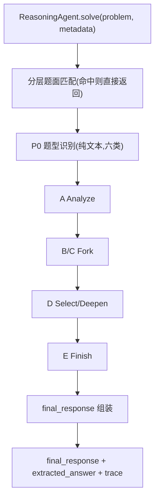
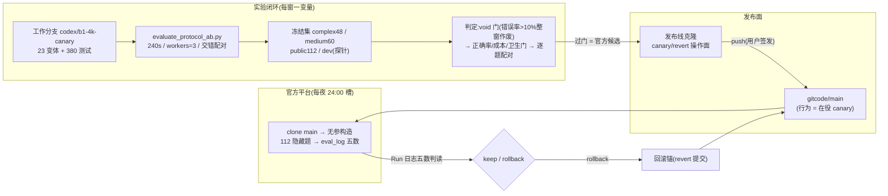

# Challenge Cup 2026 数学推理智能体

本仓库是挑战杯 2026 人工智能赛道初赛的参赛实现:一个受调用预算约束的数学
推理智能体。当前默认流水线为分层题面匹配（命中则直接返回）→ 题型识别 →
FSDF（Analyze–Fork–Select/Deepen–Finish）→ 规范化输出，同时保持赛事规定的
单文件入口与公开 client 契约。

> 当前状态（2026-09-08）：默认提交路径为 `fork_select_deepen_finish_v1`，并在
> FSDF 之前启用已提交的分层题面匹配。FSDF v1 仍无新的数学能力结论；CAR、FESF、
> Claim DSL、Host Loop、RAG、工具、MCP 和其他实验路径保持关闭。

## 当前 Agent 架构

系统是"确定性 Python Harness + 受调用预算约束的模型推理":每题 `solve()`
内独立维护候选、预算与 trace,无跨题状态,不读取 `metadata` 中的答案信息。



| 层 | 在役实现 | 备注 |
| --- | --- | --- |
| 题面匹配 | NFC/去空白/大小写归一化；全文、唯一前缀、唯一子串三层匹配 | 常开；未命中继续求解 |
| 题型识别 | 纯文本规则六分类,不读 metadata | 常开 |
| 生成 | A 分析、B/C 双思路、D 深推、E 收尾 | 难题固定五阶段 |
| 选择 | D 只能选择一个可用分支 | 非法/不可用选择 fail-closed 降级 |
| 预算 | 每题最多5次模型调用 | `[2048,2048,2048,8192,4096]`，合计18432 |
| 表示 | 允许 handoff 字段 + `HANDOFF_INCOMPLETE` | `UNKNOWN` fail-closed |
| 输出 | `final_response` 非空保证;失败路径返回兜底句 | trace 仅记决策摘要 |

### Constraint-Fit Math Harness（MATH-HARNESS-V1，提交 profile 开启）

新 Harness 位于 `reasoning_agent/math_harness.py`，通过 `ReasoningAgent.solve()` 作为
外层 opt-in 路径接入；候选实现为
`bounded_evidence_trajectory_selection_v1`。它使用有限 A/B 轨迹、Evidence Ledger、
保守选择、截断单次恢复和 5 次/16384 token 硬预算。FSDF 仍保留为 legacy backend；
提交 profile 开启 Harness、Deep lane、hybrid router 与 matcher；能力/健康/A-B 路径仍强制
bank-off。

该候选已完成双轴 Router、typed parser 和 Deep 状态机的零模型代码验收；随后按新 spec
执行 fresh 6 题 formation probe，但首 3 题均在固定 1200 秒 `deep_primary` 边界超时，
触发立即停止门。因此 formation 本身为 `NO_GO / NO_CAPABILITY_CONCLUSION`；这是用户明确
授权的提交配置覆盖，尚未形成能力 A/B 证据。formation 工件见
`docs/experiments/MATH-DEEP-FORMATION-PROBE-001/`。

### Contextual Answer Reconstruction 历史实验路径

该路径保持 default-off，仅作为历史实验实现保留；当前官方无参构造使用 FSDF。

## 项目架构与发布流



## 项目目录结构

```text
├── user_agent.py                        # Agent 核心:ReasoningAgent + 全部实验开关
├── reasoning_agent/math_harness.py       # MATH-HARNESS-V1 外层 Harness（默认关闭）
├── llm_client.py                        # 书生 API client(本地评测用)
├── main.py                              # 本地逐题 runner
├── scripts/
│   ├── evaluate_protocol_ab.py          # 实验主力 runner:23 变体/交错配对/void 熔断
│   └── evaluate_dev.py                  # 单配置 evaluator 与消融 CLI
├── sample_data/
│   ├── dev.jsonl                        # 3 题冒烟集
│   ├── public_regression_112.jsonl      # 112 题短题知识覆盖集(回归保护)
│   ├── medium_capability_freeze_60.jsonl
│   └── complex_capability_freeze_48.jsonl
├── tests/                               # 本地回归测试(当前全量 739 项,4 项跳过)
├── docs/
│   ├── excluded_approaches.md           # 淘汰方案单一事实源
│   ├── ARCHIVE_INDEX.md                 # 当前/历史文档分类索引
│   ├── archive/                         # 已移出根目录的旧总结与草稿
│   ├── research/                        # 候选依据:能力/评测方法研究 + 采纳报告
│   ├── experiments/                     # 本地与官方评测报告与工件(78+)
│   ├── adr/                             # 关键决策记录
│   ├── agents/                          # 工作流约定
│   └── branches_map.md                  # 分支与发布面地图
├── method_cards.jsonl 等                 # opt-in 实验离线资产
└── tmp/                                 # 原始工件与临时复核数据(untracked)
```

## 提交配置与实验开关板

官方 runner 以 `ReasoningAgent(client=official_client)` 无参构造，解析到
`SUBMISSION_CONFIG`：先尝试分层题面匹配，未命中后进入 `fork_select_deepen_finish_v1`，
最多5次调用、合计18432 token。题型识别、task-aware prompt、异构候选、k5 自适应投票
和答案优先提示保持在役；CAR、FESF、RAG、工具、MCP、contextual、refine、salvage
和 SymPy 保持关闭。

| 开关 | 在役 | 说明 |
| --- | --- | --- |
| `enable_fork_select_deepen_finish` | ✅ | 当前默认路径，仅完成代码验收 |
| `enable_temporary_answer_bank` | ✅ | 团队自建 `eval_112` 题面匹配；未命中继续 FSDF；不是官方题集 |
| `enable_contextual_answer_reconstruction` | ⬜ | 历史实验路径 |
| `enable_adaptive_voting`(k5/threshold3) | ✅ | FSDF v1 候选一致性投票 |
| `enable_heterogeneous_reasoners` | ✅ | 新路径候选生成 |
| `enable_step_verification` / `enable_step_revision` | ⬜ | refine 已撤下 |
| `enable_answer_dual_form`(ARH) | ⬜ | 默认关闭 |
| `enable_gsa_aggregation`(GSA) | ⬜ | 回滚锚 `e9df37e` |
| `enable_numeric_chain_of_draft`(CoD) | ⬜ | ARCHIVED |
| `enable_re2_reread`(Re2) | ⬜ | ARCHIVED(官方回滚) |
| `enable_failure_salvage`(P1) | ⬜ | ARCHIVED |
| `enable_verification_gated_retry`(B1) | ⬜ | 被投票路径替代 |
| `enable_method_rag` | ⬜ | 永久排除(双轮双负) |

## 赛事接口

仓库根目录的 `user_agent.py` 导出:

```python
from user_agent import ReasoningAgent

agent = ReasoningAgent(client=official_client)
result = agent.solve(problem, metadata)
```

返回值是可 JSON 序列化的字典,并始终包含非空字符串 `final_response`。
智能体只依赖公开模型调用契约 `client.chat(messages, temperature, max_tokens)`;
不访问 client 私有字段,不读取样例 `answer`,不依赖本地绝对路径,trace 不保存
完整 Prompt、冗长模型原文或敏感信息。

## 快速开始

建议使用 Python 3.10+。

```powershell
python -m venv .venv
.\.venv\Scripts\Activate.ps1
python -m pip install -r requirements.txt
```

本地调用需要配置书生 API:

```powershell
$env:INTERN_API_KEY = "your-api-key"
# 可选:$env:INTERN_MODEL = "intern-s2-preview-397b"
```

运行 3 道快速冒烟题:

```powershell
python main.py --input_file sample_data/dev.jsonl --output_dir sample_outputs
```

## 本地评测与实验纪律

- **主力 runner**:`scripts/evaluate_protocol_ab.py`(多臂交错配对、240s 超时、
  连续失败熔断、逐题诊断)。筛选窗一律**预注册**:门槛与 void 门
  (任一臂错误率 >10% 整窗作废)在运行前冻结。
- 判定顺序:void 门 → 正确率门 → 成本门 → 卫生门 → 逐题配对差分。
- 本地 AnswerJudge 为保守三态(精确一致/结构化有理数一致/UNKNOWN),不等同
  官方 judger;报告口径含平均/P95 调用、completion tokens、墙钟、invalid 与
  正确数并列。

## 测试与提交前检查

```powershell
python -m unittest discover -s tests -q
python -m py_compile user_agent.py llm_client.py sympy_adapter.py main.py scripts/evaluate_dev.py
```

提交前还应确认:`user_agent.py` 可正常
import;`ReasoningAgent(client=official_client)` 可初始化;client 失败时仍返回
可序列化非空 `final_response`;仓库无 API key、个人路径与样例答案特判;实际
提交配置与 A/B 报告中的配置一致。

## 当前路线

- **在役**：分层题面匹配 + `fork_select_deepen_finish_v1`；匹配层只对已提交题库命中，
  FSDF 仍无新的真实能力结论。
- **运营锚**：`hetero_k5 @ 25f99b5`（GitCode `34bc353`）。
- **发布状态**：用户已授权默认切换并合并 GitCode；官方结果仍需单独核验。
- **已淘汰**(详见 `docs/excluded_approaches.md`):method_rag、Re2、CoD、
  P1 salvage、G 门控、TIR/回代验证、32k 天花板。
- **暂不引入**:LLM-as-judge 本地判分、PRM 组件、LangGraph/AgentScope、
  联网工具与任意代码执行。

详细证据与决策记录见:`docs/experiments/`(六轮官方与全部本地报告)、
[docs/excluded_approaches.md](docs/excluded_approaches.md)、
[docs/adr/](docs/adr/)、[docs/branches_map.md](docs/branches_map.md)。

## 官方提交

赛事特有规则以[飞书赛事文档](https://aicarrier.feishu.cn/wiki/L90FwD9gJiqdg0k33RCcHTdcnrb)
为准。评测拉取作品关联仓库的最新 `main` 分支(每日固定窗口,实测均在凌晨
队列后执行)。

1. 将可复现版本推送到队伍 AtomGit 组织仓库的 `main` 分支(走发布线克隆)。
2. 在作品页面保持关联与提交状态。
3. 每轮结果按五数判读并记入 `docs/experiments/官方评测记录.md`,回滚条件
   在发布记录中预写。

提交、推送和作品页面操作都应单独确认。本地数据集结果只用于研发,不代表
正式成绩。
