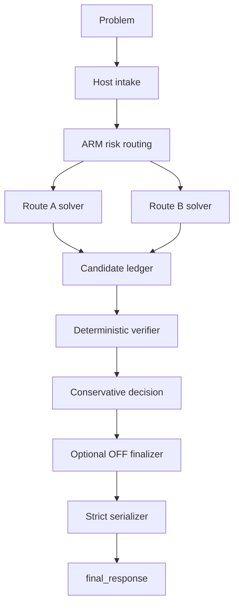

# Challenge Cup 2026 数学推理 Agent

本仓库的正式入口是一个有界、可审计的 EACL（Evaluation-Aligned Candidate Ledger）控制平面。它把模型推理、候选抽取、确定性验证、裁决和最终序列化分开，避免模型直接承担提交格式和多候选决策。

## 当前架构


```mermaid
flowchart TD
    P[Problem] --> I[Host intake]
    I --> R[ARM risk routing]
    R --> A[Route A solver]
    R --> B[Route B solver]
    A --> L[Candidate ledger]
    B --> L
    L --> V[Deterministic verifier]
    V --> D[Conservative decision]
    D --> F[Optional OFF finalizer]
    F --> S[Strict serializer]
    S --> O[final_response]
```

- **Route**：按题目复杂度选择 direct、structured 或 deep lane，并分配 Thinking ON/OFF。
- **Candidate ledger**：主机侧提取、规范化和记录候选，不把模型自报的“已验证”当作证据。
- **Verification**：只使用安全的确定性检查；无法证明时保持 `UNKNOWN`。
- **Decision**：冲突、截断或不完整候选走保守裁决，必要时有限升级，禁止无界 rollout。
- **Serialization**：最终答案由主机侧生成，模型不直接决定比赛协议。

官方无参入口 `ReasoningAgent(client=official_client)` 默认使用 EACL：

```python
from user_agent import ReasoningAgent

agent = ReasoningAgent(client=official_client)
result = agent.solve(problem, metadata)
```

返回值始终是可 JSON 序列化字典，并包含非空字符串 `final_response`。旧版 ARM/FSDF 实现已经从运行代码移除，历史行为只在研究文档和 Git 历史中保留。

## 本地运行

```powershell
python scripts/run_eacl.py `
  --input_file path/to/problems.jsonl `
  --run_dir artifacts/<run-id> `
  --max_model_calls 3 `
  --total_token_budget 12288 `
  --timeout_seconds 180 `
  --retry_count 1 `
  --thinking_on `
  --no-off_finalizer
```

运行产物统一写入 `artifacts/<run-id>/`。提交到 Git 的是源码、测试、配置和压缩后的实验结论；逐题答案、manifest、metrics 和完整模型响应留在被忽略的运行目录。

## 验证

```powershell
python -m unittest discover -s tests -p 'test_*.py'
```

提交前至少验证：

1. `user_agent.py` 可以导入；
2. 无参 `ReasoningAgent` 走 `grh_eacl_v1`；
3. EACL 单题调用数和 token 预算有界；
4. 解析、确定性验证和 fail-closed 裁决测试通过。

## 研究与历史记录

- `docs/architecture/`：当前架构、边界和迁移说明。
- `docs/research/`：外部调研与架构依据。
- `docs/experiments/`：实验预注册和压缩结果。
- `docs/archive/`：已淘汰方案的文档记录。

历史实验代码不属于正式运行路径。大体积 reference RAG、方法卡检索和对应模型资产已从仓库移除；保留的研究文档用于追溯删除依据和实验结论。
