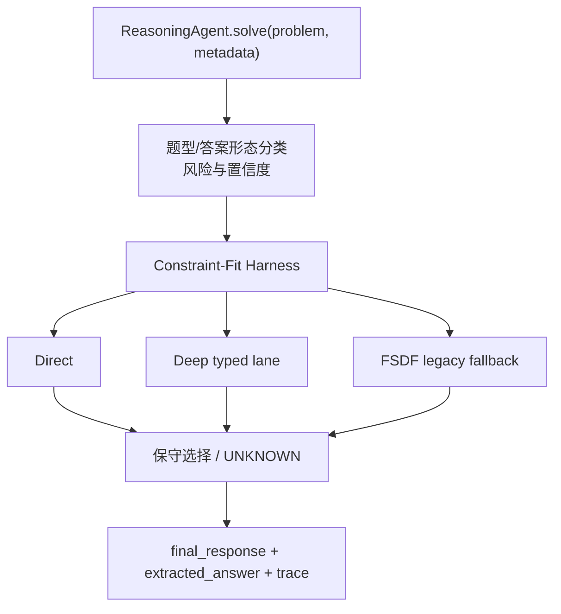
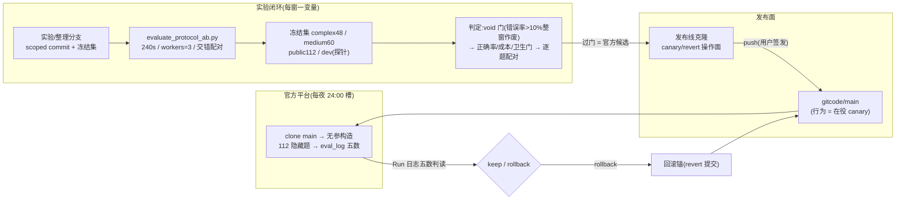

# Challenge Cup 2026 数学推理智能体

本仓库是挑战杯 2026 人工智能赛道初赛的参赛实现:一个受调用预算约束的数学
推理智能体。当前提交 profile 的默认流水线为题型/答案形态分类 →
Constraint-Fit Harness（Direct/Deep/FSDF fallback）→ 规范化输出，同时保持赛事
规定的单文件入口与公开 client 契约。

> 当前状态（2026-09-21）：默认提交路径关闭 reference-example RAG、Skill 和答案 bank，
> 先做题型/答案形态分类，再进入 Constraint-Fit/FSDF。CAR、FESF、Claim DSL、Host Loop、
> 工具和 MCP 保留为显式实验层，不属于默认路径。

## 当前 Agent 架构

系统是"确定性 Python Harness + 受调用预算约束的模型推理":每题 `solve()`
内独立维护候选、预算与 trace,无跨题状态,不读取 `metadata` 中的答案信息。


```mermaid
flowchart TD
    entry["ReasoningAgent.solve(problem, metadata)"] --> classify["题型/答案形态分类<br/>风险与置信度"]
    classify --> harness["Constraint-Fit Harness"]
    harness --> direct["Direct"]
    harness --> deep["Deep typed lane"]
    harness --> fsdf["FSDF legacy fallback"]
    direct --> finalize["保守选择 / UNKNOWN"]
    deep --> finalize
    fsdf --> finalize
    finalize --> out["final_response + extracted_answer + trace"]
```

| 层 | 在役实现 | 备注 |
| --- | --- | --- |
| 语义参考 RAG | Qwen3-Embedding-0.6B + Chroma 15,383 条 | 代码保留；提交 profile 默认关闭 |
| 题型/学科分类 | 纯文本规则六类答案形态 + 18 学科词汇路由 | 常开；不读 metadata |
| 学科 Skill | Intern1 18 份手册的安全投影 | 代码保留；提交 profile 默认关闭 |
| 生成/路由 | Direct A/B、Deep primary/review、FSDF A/B/C/D/E | 由 HostRouter 按合同分流 |
| 选择 | Evidence Ledger + HostParser/TypedParser | 非法、冲突或不可验证时 `UNKNOWN` |
| 预算 | Harness 每题最多 5 次模型调用 | Harness 总预算 16,384 tokens；FSDF 有自身有界预算 |
| 表示 | 结构化候选、typed parse、handoff | `UNKNOWN` fail-closed |
| 输出 | `final_response` 非空保证;失败路径返回兜底句 | trace 仅记决策摘要 |

### Constraint-Fit Math Harness（MATH-HARNESS-V1，提交 profile 开启）

新 Harness 位于 `reasoning_agent/math_harness.py`，通过 `ReasoningAgent.solve()` 接入；
候选实现为
`bounded_evidence_trajectory_selection_v1`。它使用有限 A/B 轨迹、Evidence Ledger、
保守选择、截断单次恢复和 5 次/16384 token 硬预算。FSDF 仍保留为 legacy backend；
提交 profile 开启 Harness、Deep lane、hybrid router；RAG、Skill 和答案 bank 不进入正式路径。

该候选已完成双轴 Router、typed parser 和 Deep 状态机的零模型代码验收；随后按新 spec
执行 fresh 6 题 formation probe，但首 3 题均在固定 1200 秒 `deep_primary` 边界超时，
触发立即停止门。因此 formation 本身为 `NO_GO / NO_CAPABILITY_CONCLUSION`；这是用户明确
授权的提交配置覆盖，尚未形成能力 A/B 证据。formation 工件见
`docs/experiments/MATH-DEEP-FORMATION-PROBE-001/`。

### Contextual Answer Reconstruction 历史实验路径

该路径保持 default-off，仅作为历史实验实现保留；当前官方无参构造使用 FSDF。

## 项目架构与发布流


```mermaid
flowchart LR
    subgraph official["官方平台(每夜 24:00 槽)"]
        judge["clone main → 无参构造<br/>112 隐藏题 → eval_log 五数"]
    end
    subgraph deploy["发布面"]
        gitcode["gitcode/main<br/>(行为 = 在役 canary)"]
        release["发布线克隆<br/>canary/revert 操作面"]
    end
    subgraph loop["实验闭环(每窗一变量)"]
        branch["实验/整理分支<br/>scoped commit + 冻结集"]
        runner["evaluate_protocol_ab.py<br/>240s / workers=3 / 交错配对"]
        sets["冻结集 complex48 / medium60<br/>public112 / dev(探针)"]
        judge2["判定:void 门(错误率>10%整窗作废)<br/>→ 正确率/成本/卫生门 → 逐题配对"]
    end
    branch --> runner --> sets --> judge2
    judge2 -->|"过门 = 官方候选"| release
    release -->|"push(用户签发)"| gitcode --> judge
    judge -->|"Run 日志五数判读"| decision{"keep / rollback"}
    decision -->|"rollback"| anchor["回滚锚(revert 提交)"] --> gitcode
```

## 项目目录结构

```text
├── user_agent.py                        # Agent 兼容 facade: ReasoningAgent + 配置
├── reasoning_agent/answer_parsing.py      # 纯答案抽取、规范化与确定性检查
├── reasoning_agent/harness_contracts.py   # Harness 合同、候选与 typed parser
├── reasoning_agent/math_harness.py       # MATH-HARNESS-V1 编排、预算与路由
├── reasoning_agent/profiles.py            # 本地 submission、agent-default、ARM 实验 profile
├── llm_client.py                        # 书生 API client(本地评测用)
├── main.py                              # 本地逐题 runner
├── scripts/
│   ├── evaluate_protocol_ab.py          # 实验主力 runner:23 变体/交错配对/void 熔断
│   └── evaluate_dev.py                  # 单配置 evaluator 与消融 CLI
├── sample_data/
│   ├── dev.jsonl                        # 3 题冒烟集
│   ├── medium_capability_freeze_60.jsonl
│   └── complex_capability_freeze_48.jsonl
├── reasoning_agent/error_notebook/eval_112.json # 本地 112 题测试集
├── tests/                               # 本地回归测试(当前全量 945 项,4 项跳过)
├── docs/
│   ├── excluded_approaches.md           # 淘汰方案单一事实源
│   ├── ARCHIVE_INDEX.md                 # 当前/历史文档分类索引
│   ├── archive/                         # 已移出根目录的旧总结与草稿
│   ├── research/                        # 候选依据:能力/评测方法研究 + 采纳报告
│   ├── experiments/                     # 可读实验总结与历史证据
│   ├── adr/                             # 关键决策记录
│   ├── agents/                          # 工作流与仓库卫生约定
│   ├── architecture_evolution.md        # 版本/架构演进总表
│   └── branches_map.md                  # 分支与发布面地图
├── method_cards.jsonl 等                 # opt-in 实验离线资产
└── artifacts/<run_id>/                 # 被忽略的本地运行产物
```

## 提交配置与实验开关板

官方 runner 以 `ReasoningAgent(client=official_client)` 无参构造，解析到当前分支的
`SUBMISSION_CONFIG`：reference-example RAG 与 Skill 保持关闭，先做题型/学科分类，随后由 Constraint-Fit Router 分流，
direct 进入 Direct Harness，deep/structured/低置信题进入 FSDF legacy fallback。
当前这是分支上的显式 canary 配置；Deep formation 与 Direct Health 均未过健康门，
尚未形成能力 A/B 证据，main 发布面不随此分支自动改变。

| 开关 | 在役 | 说明 |
| --- | --- | --- |
| `enable_fork_select_deepen_finish` | ✅ | Constraint-Fit 的 FSDF legacy fallback |
| `enable_reference_rag` | ⬜ | 提交路径关闭；仅显式实验配置启用 |
| `enable_reference_skills` | ⬜ | 提交路径关闭；仅显式实验配置启用 |
| `enable_temporary_answer_bank` | ⬜ | 默认路径已移除；底层旧 gateway 仅保留显式测试兼容 |
| `enable_contextual_answer_reconstruction` | ⬜ | 历史实验路径 |
| `enable_adaptive_voting`(k5/threshold3) | ✅ | FSDF v1 候选一致性投票 |
| `enable_heterogeneous_reasoners` | ✅ | 新路径候选生成 |
| `enable_step_verification` / `enable_step_revision` | ⬜ | refine 已撤下 |
| `enable_answer_dual_form`(ARH) | ⬜ | 默认关闭 |
| `enable_gsa_aggregation`(GSA) | ⬜ | 回滚锚 `e9df37e` |
| `enable_numeric_chain_of_draft`(CoD) | ⬜ | ARCHIVED |
| `enable_re2_reread`(Re2) | ⬜ | ARCHIVED(官方回滚) |
| `enable_failure_salvage`(P1) | ⬜ | ARCHIVED |
| `enable_verification_gated_retry`(B1) | ⬜ | 被投票路径替代 |
| `enable_method_rag` | ⬜ | 永久排除(双轮双负) |

## 赛事接口

仓库根目录的 `user_agent.py` 导出:

```python
from user_agent import ReasoningAgent

agent = ReasoningAgent(client=official_client)
result = agent.solve(problem, metadata)
```

返回值是可 JSON 序列化的字典,并始终包含非空字符串 `final_response`。
智能体只依赖公开模型调用契约 `client.chat(messages, temperature, max_tokens)`;
不访问 client 私有字段,不读取样例 `answer`,不依赖本地绝对路径,trace 不保存
完整 Prompt、冗长模型原文或敏感信息。

## 快速开始

建议使用 Python 3.10+。

```powershell
python -m venv .venv
.\.venv\Scripts\Activate.ps1
python -m pip install -r requirements.txt
```

本地调用需要配置书生 API:

```powershell
if (-not (Test-Path .env)) { Copy-Item .env.example .env }
notepad .env
```

在 `.env` 中填写 `INTERN_API_KEY`；本地评测模型固定为
`INTERN_MODEL=intern-s2`。`llm_client.py` 会自动加载仓库根目录的
`.env`，其中的值优先于同名 Windows 环境变量。`.env` 已被 Git 忽略，不要提交密钥。
`INTERN_API_BASE` 默认使用官方兼容端点；超时、重试和 thinking 模式按各实验协议设置，
不要为了方便写成会改变冻结实验的全局覆盖值。

运行 3 道快速冒烟题:

```powershell
python main.py --input_file sample_data/dev.jsonl --output_dir artifacts/20260928-135512-dev-smoke
```

运行产物应使用唯一的 `artifacts/<run_id>/` 目录，例如
`artifacts/20260928-135512-dev-smoke/`；不要把逐题 JSON、manifest 或 report
写入源码目录或 `docs/experiments/`。完整约定见
[`docs/agents/repository-hygiene.md`](docs/agents/repository-hygiene.md)。

本地 runner 可用 profile 开关整组切换功能；默认仍是官方提交 profile。
`arm-off`、`arm-on`、`arm-static` 和 `arm-adaptive` 是显式本地实验配置，
不会改变官方提交配置：

```powershell
python main.py --input_file sample_data/dev.jsonl --output_dir artifacts/20260928-135512-submission --profile submission
python main.py --input_file sample_data/dev.jsonl --output_dir artifacts/20260928-135512-agent-default --profile agent-default
python main.py --input_file sample_data/dev.jsonl --output_dir artifacts/20260928-135512-arm-adaptive --profile arm-adaptive
```

ARM-Harness v2.1 的串行 accuracy-first runner 使用固定的
`reasoning_agent/error_notebook/eval_112.json`，并提供
`arm-v2.1-off`、`arm-v2.1-on` 和 `arm-v2.1-off-skill` 三个显式 profile：

```powershell
python scripts/run_arm_v21_eval112_timing.py --profile arm-v2.1-off --run-id ARM-V21-OFF-112-ACCURACY-001
python scripts/run_arm_v21_eval112_timing.py --profile arm-v2.1-on --run-id ARM-V21-ON-112-ACCURACY-001
```

每题严格只执行一次 `solve()`，结果状态为 `complete`、`incomplete` 或 `error`；失败题也会写入
`answers.jsonl` 和 aggregate denominator，并保留 `final_failure_reason`。完整答复由本地 evaluator
评分，标准答案不发送给模型。报告同时记录 second-sample、resolver、safe-candidate 和 final-source
telemetry；数据集缺失或不是 112 条唯一题目时 runner 会直接失败。本地结果不自动触发提交晋升。

ARM 配置及其逐次调用 reasoning mode 仅用于代码和本地实验验证；启用 ON 的
profile 会显式发送 `thinking_mode=true`，运行前应按冻结实验协议检查 endpoint 健康。
默认 `SUBMISSION_CONFIG` 不启用 ARM，代码路径不代表数学能力或官方成绩提升。

该开关只影响本地 `main.py` runner；官方仍通过
`ReasoningAgent(client=official_client)` 使用 `SUBMISSION_CONFIG`，不会被本地
profile 按钮或命令行参数隐式改变。

## 本地评测与实验纪律

- **主力 runner**:`scripts/evaluate_protocol_ab.py`(多臂交错配对、240s 超时、
  连续失败熔断、逐题诊断)。筛选窗一律**预注册**:门槛与 void 门
  (任一臂错误率 >10% 整窗作废)在运行前冻结。
- 判定顺序:void 门 → 正确率门 → 成本门 → 卫生门 → 逐题配对差分。
- 本地 AnswerJudge 为保守三态(精确一致/结构化有理数一致/UNKNOWN),不等同
  官方 judger;报告口径含平均/P95 调用、completion tokens、墙钟、invalid 与
  正确数并列。

## 测试与提交前检查

```powershell
python -m unittest discover -s tests -q
python -m py_compile user_agent.py llm_client.py sympy_adapter.py main.py scripts/evaluate_dev.py
```

提交前还应确认:`user_agent.py` 可正常
import;`ReasoningAgent(client=official_client)` 可初始化;client 失败时仍返回
可序列化非空 `final_response`;仓库无 API key、个人路径与样例答案特判;实际
提交配置与 A/B 报告中的配置一致。

## 当前路线

- **当前 checkout**：Constraint-Fit Harness 的 Direct/Deep/FSDF fallback seam；
  reference RAG、Skill、答案 bank 和历史候选均默认关闭，尚未形成新的数学能力结论。
- **历史运营锚**：`hetero_k5 @ 25f99b5`（GitCode `34bc353`），仅作为历史发布/回滚参照。
- **发布状态**：当前是本地整理分支，未自动改变 GitCode/main 或赛事作品；远端发布面单独记录。
- **已归档/排除**(详见 `docs/excluded_approaches.md`):method_rag、Re2、CoD、
  P1 salvage、G 门控、TIR/回代验证、32k 天花板。
- **暂不引入**:LLM-as-judge 本地判分、PRM 组件、LangGraph/AgentScope、
  联网工具与任意代码执行。

详细证据与决策记录见按实验 ID 分类的 `docs/experiments/`、
[架构演进总表](docs/architecture_evolution.md)、
[每日官方评测归档](docs/official_evaluations/)、
[docs/excluded_approaches.md](docs/excluded_approaches.md)、
[docs/adr/](docs/adr/)、[docs/branches_map.md](docs/branches_map.md)。

## 官方提交

赛事特有规则以[飞书赛事文档](https://aicarrier.feishu.cn/wiki/L90FwD9gJiqdg0k33RCcHTdcnrb)
为准。评测拉取作品关联仓库的最新 `main` 分支(每日固定窗口,实测均在凌晨
队列后执行)。

1. 将可复现版本推送到队伍 AtomGit 组织仓库的 `main` 分支(走发布线克隆)。
2. 在作品页面保持关联与提交状态。
3. 每轮结果按五数判读并记入 `docs/official_evaluations/README.md`,回滚条件
   在发布记录中预写。

提交、推送和作品页面操作都应单独确认。本地数据集结果只用于研发,不代表
正式成绩。
