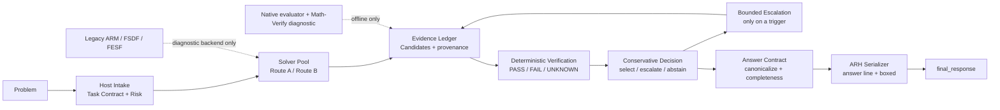

# GRH 全架构重设计：Evaluation-Aligned Candidate Ladder

日期：2026-10-03  
目标工作区：`Challenge-Cup-2026-v11-release`  
设计版本：`GRH v1.4-EACL`（设计稿，不代表已经晋升默认提交）

## 1. 结论先行

这次不把 ARM 换成另一个同样庞大的状态机。ARM 的问题不是名字或某个 prompt，而是它同时承担了求解、候选生成、升级、恢复、裁决和输出，导致每一层的失败都被混在一起：模型不会做、模型做了但没有闭合候选、候选冲突、解析失败、截断和官方判分不识别，最后都可能表现为 `invalid`。

新的总架构改为分层管线：



核心职责如下：

| 层 | 负责什么 | 不负责什么 |
| --- | --- | --- |
| Host Intake | 识别题型、答案形状、风险和预算 | 不求解数学题 |
| Solver Pool | 生成一个或两个路线不同的候选 | 不决定提交格式 |
| Evidence Ledger | 记录候选、来源、闭合状态、冲突和验证证据 | 不读取 gold |
| Deterministic Verification | 做可计算的代入、等价、边界、有限枚举和约束检查 | 不把模型自评当验证 |
| Conservative Decision | 选择、有限升级或 UNKNOWN | 不凭偏好在冲突候选中猜答案 |
| Answer Contract | 规范化、完整性检查、冲突拒绝 | 不证明数学正确 |
| ARH Serializer | 输出官方更可能稳定识别的最终文本 | 不重新解题 |
| Legacy backend | 作为独立实验或回滚锚 | 不进入新默认总控器 |

## 2. 证据边界

### 2.1 已验证事实

`docs/research/evaluation_adoption_提分行动_2026-08-29.md` 对 9 个公开判分实现做了源码级核对。跨口径共同安全区是：

```text
boxed 包裹 + 最简规范形 + 无解释性尾缀
```

源码直接支持的失败面包括：

- 小数与最简分数在多数口径下不等价；
- 无序集合、区间和单位表示缺少统一归一化；
- 自造数学记法可能导致解析失败；
- 只取最后答案的抽取器会被尾缀稀释；
- 缺少目标句式时会被判为 invalid；
- 不同公开判分实现对同一答案的分数差异可以超过 5 个百分点。

这些事实直接支持 Answer Contract 和 ARH，但不能证明官方评测一定使用其中某一个实现。

### 2.2 数据支持的推断

- 当前大量 invalid 的一部分可能是“答案已经出现在响应中，但没有形成稳定提交面”；
- 另有一部分 invalid 属于截断、没有候选或真正的推理失败，不能通过格式化救回；
- ARM 的候选恢复可以保留历史证据，但 ARM 的整体状态机不应继续承担总架构；
- 输出卫生与求解能力是正交变量，必须使用同题配对实验分别估计。

### 2.3 尚未验证的假设

- ARH 双形态在官方判分器上一定优于单形态；
- v1.3 离线审计中的 6 个安全 host replay 会转化为官方 `correct`；
- 路线多样性一定提升数学正确率；
- Thinking ON 在新的候选协议下会优于 OFF。

所有尚未验证的项必须通过冻结集双轮 A/B，不能由一次官方分数或一轮本地 replay 直接推出。

## 3. 为什么不继续扩展 ARM

当前 ARM 层已经覆盖：

- primary / challenger；
- OFF / ON / adaptive thinking；
- safe incumbent；
- timeout recovery；
- skill guidance；
- resolver / repair；
- finalization；
- trace ledger。

继续在 ARM 中添加新分支，会产生三个问题：

1. 每个题目可能经历固定状态机，即使首个候选已经足够；
2. 候选生成与候选裁决共享上下文，第二路线容易变成同路线重复；
3. 超时、截断、格式失败和数学失败无法在报告中分离。

新设计保留 ARM 代码用于历史复现和独立对照，但总控器不再调用 `arm_harness_v2.py` 作为默认入口。以后新增机制只能进入明确的 Solver、Verification 或 Serialization 层。

## 4. 新架构的运行协议

### 4.1 Host Intake

每次 `solve()` 建立一次性 `ProblemContract`，题目之间不共享状态。合同至少包含：

```python
ProblemContract(
    answer_type="integer | rational | expression | set | choice | proof | unknown",
    completeness_rule="one_closed_candidate",
    risk="direct | structured | deep",
    budget_class="fast | normal | hard",
)
```

合同只能从题面和合法 metadata 推导，不能读取本地 gold、答案库或前题结果。

风险路由采用通用信号：题型、约束数量、证明/构造词、多个未知量、分段条件、候选形状和历史运行时 telemetry。禁止按题号或固定题面片段硬编码。

### 4.2 Solver Pool

Solver 只产生候选和有限理由，不负责最终提交。默认采用候选优先协议：

```text
CANDIDATE: <one current value>
REASON: <at most three short lines>
```

候选协议不要求模型输出完整证明，也不把 `CANDIDATE` 当作已验证结论。对于证明题和长推导题，solver 可以保留压缩推导，但必须在响应中形成独立的闭合候选。

候选最多来自两个路线族：

| Route | 适用情况 | 典型策略 |
| --- | --- | --- |
| A | 默认首选 | 定义/公式/正向推导 |
| B | A 缺失、截断、低置信或冲突 | 反证、边界、构造、代入、有限枚举或另一种标准方法 |

Route B 必须使用独立上下文，不读取 A 的完整答案；只允许读取题目和 host 合同。这样“路线多样性”才是真正的实验变量。

### 4.3 Evidence Ledger

每道题使用内存中的有界账本，题目结束即丢弃：

```python
CandidateRecord(
    candidate_id,
    route_family,
    method_signature,
    value,
    canonical_value,
    completeness,
    source_span_hash,
    finish_reason,
    truncated,
    verification_status,
    confidence,
)
```

账本必须记录：

- 候选是否闭合；
- 候选来源是 marker、boxed、typed surface 还是 terminal line；
- 是否出现多个不同 canonical value；
- 是否发生 `finish_reason=length`；
- 当前候选是否已经通过确定性检查；
- 使用了几次调用、多少 requested/completion tokens、耗时多少。

trace 只保存诊断摘要，不保存完整 prompt、完整思维链或 gold。

### 4.4 Deterministic Verification

验证优先使用 host 可执行检查：

1. 整数、分数和单位的结构检查；
2. 代入原约束；
3. 数值等价和有界符号等价；
4. 边界值、定义域和单位检查；
5. 有限域枚举；
6. 对安全表达式使用 SymPy 或既有 verifier adapter。

输出固定为三态：

```text
PASS      有足够的确定性证据支持候选
FAIL      有可复现的约束或等价性反例
UNKNOWN   没有安全的确定性检查器
```

`UNKNOWN` 不能被解释成正确，也不能由另一个 LLM 的“看起来合理”覆盖。

Math-Verify 只进入本地诊断并行口径，不能替换仓库当前正式 evaluator，也不能进入比赛运行时依赖。

### 4.5 Conservative Decision

决策器是有限状态机，但它不再和 ARM 的求解状态机绑定：

```text
START
  └─ Route A
       ├─ closed + PASS → SELECT A
       ├─ closed + UNKNOWN → SELECT only if no conflict and contract-safe
       ├─ missing / incomplete / length → Route B
       └─ conflict → deterministic comparison → Route B if unresolved

Route B
  ├─ canonical equivalent → SELECT canonical value
  ├─ one PASS and one FAIL → SELECT PASS
  ├─ both UNKNOWN but same value → SELECT only for safe answer shape
  ├─ conflicting values → one short adjudication or UNKNOWN
  └─ no closed candidate → UNKNOWN
```

第三次调用只允许两种用途：

- 短的候选闭合/恢复；
- 只读取已有 canonical candidate 的格式终结。

第三次调用禁止重新进行无限长推理，禁止在两个冲突答案之间凭模型偏好投票。

### 4.6 Answer Contract 与 ARH

Answer Contract 将 solver 输出和比赛提交格式解耦：

```text
solver response
    → candidate extraction
    → canonicalization
    → structural/completeness validation
    → semantic verification when available
    → serializer
```

对数值、整数、分数、选择题和有限集合，ARH 实验候选使用：

```text
最终答案：<canonical>
$\boxed{<canonical>}$
```

要求：

- canonical 使用最简分数、稳定集合序、无单位尾缀和无多余解释；
- 答案句和 boxed 内容必须是同一 canonical value；
- 最后一行不再追加解释性数字；
- proof、derivation、explanation 不强行套双形态，只使用已有的答案优先正文合同；
- candidate 缺失、冲突或不完整时返回 `UNKNOWN`，不能生成占位答案。

ARH 是纯后处理候选，零新增模型调用、零 prompt 变化。只有通过 paired gate 后，才允许进入默认提交配置。

## 5. 预算与调用策略

默认正式上限：

| 阶段 | 最大调用 | requested token 建议 | 触发 |
| --- | ---: | ---: | --- |
| Route A | 1 | 4,096–8,192 | 所有题 |
| Route B | 1 | 4,096–6,144 | A 缺失、截断、低置信或冲突 |
| Finalizer / recovery | 1 | ≤1,024 | 仅已有闭合候选且只需格式闭合 |
| 总计 | ≤3 | ≤16,384 | 单题硬上限 |

单题墙钟保持在赛事 20 分钟以内，整轮设计目标为 5.5 小时以内。非流式 client 无法在请求内部安全 early-stop，因此 host early-stop 只能阻止后续调用，不能虚报已经节省了当前请求 token。

## 6. 现有模块的处置

| 当前模块 | 新架构处置 | 原因 |
| --- | --- | --- |
| `reasoning_agent/answer_contract.py` | 保留并扩展为公共合同 | 是新架构的边界类型 |
| `candidate_canonicalizer.py` | 保留，增加题型特定规范化测试 | 直接承接 ARH 前的候选面 |
| `invalid_recovery.py` | 保留，改名义上作为 Decision Policy | R1–R6/S1–S6 可复用，但不能单独宣称能力提升 |
| `verification_gates.py` | 保留，新增安全 verifier adapter | 验证结果必须三态、可追溯 |
| `invalid_ledger.py` | 保留为离线诊断工具 | 不进入正式题间持久化状态 |
| `finalizer.py` | 保留为可选 OFF formatter | 只允许复述已有 canonical candidate |
| `grh_v13.py` | 演化为 `eacl_pipeline.py` | 由 replay 组合器变成正式分层编排器 |
| `arm_harness_v2.py` | 冻结为 legacy backend | 保留历史复现，不作为总控器 |
| `arm_v21_support.py` | 冻结 | ARM 专属策略不再扩张 |
| `fork_select_deepen_finish.py` | 作为 Route A/B solver backend 实验 | 不允许继续扩大固定五阶段协议 |
| `math_harness.py` | 拆出 Solver Pool、Decision、Serializer 三个 seam | 当前文件承担过多职责，先做边界拆分 |
| `safe_candidate.py` | 保留为 ledger state，不作为数学 truth | safe 只表示不丢弃证据 |
| `user_agent.py` | 只保留薄 facade | 新架构通过独立 orchestrator 注入，避免继续膨胀 |

## 7. 与 ARM、FSDF、FESF 的关系

### ARM

ARM 降级为历史复现和诊断 backend。它不被删除，因为需要复核历史官方约 23 correct 的运行，但不再作为新默认架构的总控器。

### FSDF

FSDF 的异构候选和阶段交接可以作为 Route A/B 的一个 solver backend。固定 Analyze → B/C → D → E 不能成为所有题目的必经路径；候选已闭合时应提前结束。

### FESF

FESF 的 claim DSL、LLM judge 和 PRM 路线继续保持 default-off。确定性 verifier adapter 可在 host verification 层按单变量重新评估，但不能把 FESF 的严格协议整栈接回默认路径。

## 8. 实施切分

### P0：输出合同（零模型调用）

- 将 `answer_contract`、`candidate_canonicalizer` 和 ARH serializer 组合成独立模块；
- 覆盖整数、最简分数、集合、区间、单位、选择题和 proof fallback；
- 通过所有旧输出的 replay，确认 canonical value 不改变；
- 不改变默认提交配置。

验收：

- 100% 输入都能归类为 complete / partial / conflict / unknown；
- canonical 双形态严格相等；
- 现有 correct 样本零损伤；
- `invalid -> incorrect = 0`。

### P1：账本与确定性验证

- 把 ARM safe candidate、FSDF candidate 和普通 parser 统一写入 `CandidateRecord`；
- 增加整数/分数/集合/边界/有限枚举 verifier；
- verifier 只返回 PASS/FAIL/UNKNOWN；
- 生成完整 telemetry：calls、tokens、latency、finish_reason、candidate completeness。

验收：

- 远程调用数为 0 的 contract regression 全过；
- 不写入 gold，不依赖前题状态；
- verifier 的每个 PASS 都有可复现的本地 witness；
- unsupported case 一律 UNKNOWN。

### P2：Candidate Ladder

- Route A 生成首个短候选；
- 仅在 trigger 命中时生成独立 Route B；
- 第三调用限制为短 recovery/finalizer；
- 删除“固定每题多阶段”的默认必经路径；
- ARM 仅作为对照 backend。

验收：

- Route B 与 A 的 `route_family/method_signature/context_hash` 可审计；
- Route B 不读取 A 的完整答案；
- 平均调用数不超过基线的 1.10 倍；
- P95 latency 和整轮 5.5 小时预算通过。

### P3：ARH paired window

实验只改变 serializer：

```text
A: current final_response
B: current final_response + ARH dual form
```

两轮交错执行，使用相同题集、模型、端点和 evaluator。并行记录 native evaluator 与 Math-Verify 差集，但正式能力判定只使用冻结 native evaluator。

晋升门：

- correct 不下降；
- `correct -> incorrect = 0`；
- `correct -> invalid = 0`；
- `invalid -> incorrect = 0`；
- invalid 有稳定下降；
- 两轮 paired sign test 不出现反向显著结果；
- error/timeout、P95 和 token 成本不恶化。

### P4：Route diversity paired window

只加入独立 Route B，不同时加入 ARH 或第三调用。报告：

- invalid rescue；
- invalid damage；
- correlated wrong rate；
- RoutePairDistinct；
- candidate conflict rate；
- average/P95 calls and tokens。

未通过 P4，不得把多候选层与 ARH 组合成默认栈。

### P5：组合候选

只有 P0–P4 各自通过，才测试：

```text
Candidate Ladder + Deterministic Verification + ARH
```

组合臂相对最强单方法只能新增一个可归因变量，并必须重新进行两轮 paired window。组合臂失败时回滚到最强单方法，不回 ARM 总控器。

## 9. 统一验收指标

每个实验都必须报告：

```text
correct / incorrect / invalid / error / timeout
invalid -> correct
invalid -> incorrect
correct -> incorrect
correct -> invalid
net correct gain
model calls
requested/completion tokens
average/P95 latency
finish_reason=length
answer marker rate
complete candidate rate
candidate conflict rate
deterministic PASS/FAIL/UNKNOWN
native evaluator vs Math-Verify delta
```

唯一正向能力目标是 `correct`。invalid、error、timeout、tokens 和 latency 是安全门，不能取代正确率。

推荐使用 Wilson 95% 区间和逐题 paired sign test。112 题规模下 1–3 题的波动不能直接解释为架构提升。

## 10. 不做的事情

- 不添加 LLM-as-judge 作为运行时裁决器；
- 不添加 PRM/process reward model 作为比赛组件；
- 不依赖强制 JSON/XML 结构化输出；
- 不反推官方判分器的投机性不对称规则；
- 不把 Math-Verify 的宽松结果当正式分数；
- 不把 safe incumbent、结构合法或 parser PASS 称为数学正确；
- 不用题号、答案库、benchmark lookup 或题面特判；
- 不因 invalid 下降就自动晋升默认配置；
- 不在没有路线增量证据时增加第四、第五次模型调用。

## 11. 最终建议

下一步应把工作重点从“ARM 还能加什么分支”转移到：

1. 先完成 ARH 的零调用双轮验证；
2. 再完成统一 Candidate Ledger 和确定性 verifier；
3. 再单独验证 Route B 的有效路线多样性；
4. 最后才组合候选梯度、验证和输出序列化；
5. 只有组合臂同时通过正确率、损伤、健康和成本门，才申请新的正式提交配置。

这套架构直接使用提分行动文档中已确认的输出卫生杠杆，同时保留对真实数学能力的严格归因。它把 ARM 的历史价值保留下来，却不再让 ARM 的状态机定义整个系统。
