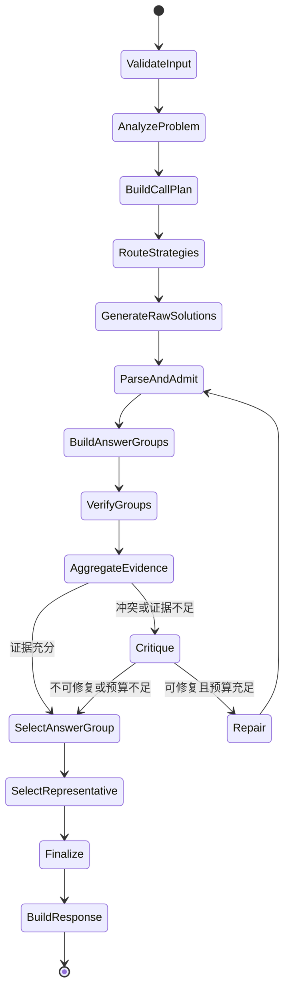

# 因果引导的数学推理智能体——技术文档

> 版本：V2.1
>
> 日期：2026-07-29
>
> 性质：技术架构、接口契约与实现规范
> 说明：本文同时记录当前代码事实和目标设计，二者不得混淆；方案与实施顺序以 `docs/系统方案文档(2).md` 为准。当前审计基线为 `main@7980b6b`，安装已声明依赖后 76 项测试通过。
> 开源依据：Math-Verify、Qwen2.5-Math、ToRA、PRM800K、MATH、DeepSeek-Prover-V1.5 与 FunSearch 的官方仓库和维护方资料

## 1. 文档范围

本文描述数学推理智能体的技术边界、运行接口、模块划分、类型化答案契约、答案组算法、分级证据裁决、阶段预算、工具适配、异常降级、测试方案和实施顺序。

系统包含两种运行形态：

1. **竞赛运行形态**：官方平台导入 `user_agent.py`，使用官方 client 调用 `ReasoningAgent.solve`。
2. **研发形态**：在竞赛内核外增加离线评测和观测；正式求解编排使用轻量 Python 状态机，不以 LangGraph 或 AgentScope 为前置。

竞赛运行形态是首要约束。任何扩展组件都不能破坏入口兼容性，也不能成为不可降级的外部依赖。

## 2. 当前代码基线

### 2.1 已实现流程

当前 `user_agent.py` 是受预算约束的“生成—抽取—审核—选择”流程：

1. 使用 Policy Prompt 采样 3 个候选解答。
2. 每个候选使用隔离上下文的 Verifier Prompt 审核 1 次。
3. 用独立函数抽取答案并做保守规范化，显式记录候选答案、证据、验证状态和调用数。
4. 按受控工具证据（实验调用者显式附加）→ 答案共识 → LLM 审核 → 固定候选 ID 进行确定性裁决。

上述“3 个候选”是当前代码事实，不是目标架构。目标是用 `DirectReasoner` 和 `AlternativeReasoner` 两个异质角色替换三次同 Prompt 采样，只在高风险题增加第三策略。

当前默认配置每题最多执行 6 次模型调用：3 次候选生成，加上每个候选 1 次隔离上下文审核。代码在每次调用前检查 `max_model_calls`，达到上限后停止新增调用并在现有候选中裁决。

### 2.2 当前优点

- 兼容 `ReasoningAgent(client=...)` 初始化方式。
- 只调用公开的 `client.chat` 方法。
- 每道题独立生成候选和验证结果。
- 返回包含 `final_response` 和 `trace` 的字典。
- 单题模型调用受 `max_model_calls` 实际约束。
- trace 只记录候选编号、状态、原因和聚合结果，不保存题目、Prompt 或模型原始输出。
- 单个模型调用失败时保留可用候选，全部失败时仍返回非空降级结果。
- 代码简单，便于继续迭代。

### 2.3 当前不足

- 所有题目固定使用相同预算，缺少动态路由。
- 候选主要通过温度采样产生，方法差异不明确。
- LLM 审核只能提供弱证据，首错自然语言不能被代码可靠结构化验证。
- `final_response` 优先返回抽取后的规范答案，可能丢失证明、解释和推导题所需的必要过程。
- 规范化仅覆盖常见数值、分数和根式；集合、区间、矩阵和一般代数等价仍未实现。
- 默认链路没有类型化答案、答案组、动态路由或批判修正闭环。
- `sympy_adapter.py` 仅为非默认的受控实验，支持受限算术表达式等价检查；离线 stdio MCP、结构化数值执行器和定理卡 RAG 尚未实现。Lean 4 只允许用于本地研究，不得进入正式 `solve` 链路。
- 没有批判和修正闭环。
- 因果算法尚未实现。

## 3. 技术选型与分层

### 3.1 竞赛内核

| 层级 | 建议技术 | 说明 |
| --- | --- | --- |
| 入口 | Python `user_agent.py` | 满足官方导入规范 |
| 编排 | 轻量确定性状态机 | 优先减少依赖和运行不确定性 |
| 模型访问 | 官方 `client.chat` | 不访问私有字段 |
| 数据契约 | Dataclass；边界复杂后可用 Pydantic | 明确区分原始解答、类型化答案、答案组和验证证据 |
| 答案处理 | Python，SymPy 可选 | 确定性抽取、类型化规范、三态等价检查 |
| 工具接入 | 仓库内置 stdio MCP | 无 HTTP 和固定端口；启动或调用失败时降级到普通模型推理 |
| 裁决 | 证据优先级策略 | 强反例优先，不把异质证据压成一个固定加权总分 |
| 测试 | pytest 或 unittest | 覆盖接口、解析、路由和降级 |

### 3.2 研发与本地验证

| 层级 | 计划技术 | 说明 |
| --- | --- | --- |
| 流程编排 | 轻量 Python 状态机 | 逻辑角色隔离，不引入大型 multi-agent 框架 |
| 数学工具 | SymPy、数值工具、有限枚举器 | 通过仓库内置 stdio MCP 受控调用；不执行模型生成的任意 Python |
| 本地知识 | BM25 或 SQLite FTS5 | 索引定理卡片，不需要 embedding 模型、GPU 或运行时下载 |
| Prompt 优化 | DSPy | 离线优化，不作为必要运行依赖 |
| 可观测性 | Langfuse | 记录 token、延迟和实验指标 |
| API 与前端 | FastAPI、React Flow | 用于演示和执行过程展示 |
| 基础设施 | PostgreSQL、Redis、Docker Compose | 不服务于单题必要路径 |

### 3.3 组件进入内核的条件

1. 能在隔离环境稳定安装。
2. 不依赖开发机路径或私有服务。
3. 失败时存在可用降级路径。
4. 对正确率或稳定性有可测量收益。
5. 不显著增加超时和资源风险。
6. 有明确的输入信任边界、证据适用范围和性质测试。

## 4. 对外接口契约

### 4.1 初始化接口

```python
class ReasoningAgent:
    def __init__(self, client, config=None, **kwargs):
        pass
```

- `client` 为必需兼容参数。
- 可接收可选配置，但不能要求平台提供额外参数。
- 不访问 `client` 私有字段。
- 不在初始化阶段启动不可控外部服务。

### 4.2 求解接口

```python
def solve(self, problem: str, metadata: dict) -> dict:
    pass
```

- `metadata` 可能包含 `idx` 和其他正常元信息。
- 逻辑不得要求其中存在答案、评分或等价字段。
- 返回值必须可 JSON 序列化。
- `final_response` 必须为非空字符串。
- `trace` 可选，但应简洁且不含敏感信息。

### 4.3 模型调用契约

系统仅依赖等价于以下形式的公开调用：

```python
content = client.chat(
    messages=[
        {'role': 'system', 'content': system_prompt},
        {'role': 'user', 'content': user_prompt},
    ],
    temperature=temperature,
    max_tokens=max_tokens,
)
```

模型返回值按字符串处理。适配器检查空值和类型异常，但不假定本地 `InternChatClient` 与官方 client 的内部实现一致。

## 5. 建议代码结构

```text
Challenge-Cup-2026/
├── user_agent.py
├── agent_core/
│   ├── config.py
│   ├── contracts.py
│   ├── orchestrator.py
│   ├── analyzer.py
│   ├── router.py
│   ├── prompts.py
│   ├── answer_parser.py
│   ├── canonicalizer.py
│   ├── equivalence.py
│   ├── answer_groups.py
│   ├── verifier.py
│   ├── evidence_policy.py
│   ├── budget.py
│   ├── critic.py
│   ├── repair.py
│   ├── finalizer.py
│   └── trace.py
├── agent_core/strategies/
│   ├── direct.py
│   ├── program_of_thought.py
│   └── alternative.py
├── agent_core/tools/
│   ├── registry.py
│   └── mcp_server/
│       ├── server.py
│       ├── sympy_tools.py
│       ├── numeric_tools.py
│       ├── enumeration_tools.py
│       └── retrieval_tools.py
├── tests/
├── docs/
├── requirements.txt
└── main.py
```

不建议第一轮就创建全部文件。应按可测试功能逐步拆分，避免为了目录完整产生空抽象。根目录 `user_agent.py` 始终保留为官方入口。

## 6. 核心数据模型

以下为目标契约。字段可以按实现阶段裁剪，但不得重新混淆“原始文本、答案身份、验证证据和执行状态”。

```python
@dataclass
class ProblemAnalysis:
    domain: str
    answer_type: str
    constraints: list[str]
    expected_precision: str | None
    answer_domain: str | None
    difficulty: str
    recommended_strategies: list[str]
    recommended_tools: list[str]
    risk_flags: list[str]

@dataclass
class RawSolution:
    candidate_id: str
    strategy: str
    raw_response: str
    assumptions: list[str]
    generation_status: str
    model_calls_used: int

@dataclass
class ParsedAnswer:
    raw_text: str
    kind: str
    canonical: str | None
    parse_status: str
    precision: str | None
    domain: str | None
    warnings: list[str]
    extraction_method: str

@dataclass
class Candidate:
    candidate_id: str
    strategy: str
    raw_solution: RawSolution
    parsed_answer: ParsedAnswer
    admission_status: str

@dataclass
class EquivalenceResult:
    verdict: str          # EQUIVALENT / NOT_EQUIVALENT / UNKNOWN
    method: str
    symmetric_checked: bool
    assumptions: list[str]
    warnings: list[str]

@dataclass
class VerificationEvidence:
    evidence_id: str
    source: str
    execution_status: str  # SUCCESS / ERROR / TIMEOUT / UNAVAILABLE
    claim_status: str      # SUPPORTED / REFUTED / NO_ERROR_FOUND / UNKNOWN
    scope: str             # final_answer / claim / step / constraint
    claim_id: str | None
    deterministic: bool
    strength: str
    assumptions: list[str]
    summary: str
    error_location: str | None
    counterexample: str | None
    warnings: list[str]

@dataclass
class AnswerGroup:
    group_id: str
    representative_answer: ParsedAnswer
    member_candidate_ids: list[str]
    strategy_support: set[str]
    evidence: list[VerificationEvidence]
    unresolved_conflicts: list[str]

@dataclass
class StageCallPlan:
    analysis_calls: int
    generation_calls: int
    verification_calls: int
    repair_calls: int
    model_finalizer_calls: int

@dataclass
class SolveState:
    problem: str
    metadata: dict
    analysis: ProblemAnalysis | None
    raw_solutions: list[RawSolution]
    candidates: list[Candidate]
    rejected_candidate_ids: list[str]
    answer_groups: list[AnswerGroup]
    call_plan: StageCallPlan
    repair_round: int
    call_count: int
    requested_output_tokens: int
    token_estimate: int | None
    trace: list[dict]
```

关键不变量：

1. 状态只在一次 `solve` 内有效，不作为跨题记忆。
2. `Candidate` 必须来自已完成入池检查的 `RawSolution`。
3. 答案组的身份仅由类型化答案和明确等价关系决定，验证状态不参与去重。
4. `call_count <= max_model_calls` 在任何状态转移后都必须成立。
5. 每条强证据必须能够追溯到验证对象、适用范围和前提假设。
6. `REFUTED` 的确定性强证据不能被多个弱支持分数抵消。

## 7. 状态机设计



状态转移使用显式条件，不依赖 Agent 自由决定整个流程。`Repair -> ParseAndAdmit` 受 `max_repair_rounds` 和剩余调用槽位双重约束。竞赛内核和本地研发均优先使用普通 Python 函数与轻量状态机，不把 LangGraph 或 AgentScope 列为实施依赖。

## 8. 问题分析与策略路由

### 8.1 轻量规则分析

- 方程、函数、化简等关键词标记代数候选。
- 整数、同余、整除标记数论或 Z3 候选。
- 概率、期望、随机变量标记概率候选。
- 证明、恒成立、充分必要标记高逻辑风险。
- 所有、存在、至少、至多等词标记约束风险。

规则无法确定且调用计划为分析阶段预留了槽位时，才调用分析 Prompt。分析输出解析失败时使用通用路由，不重试或挪用未授权槽位，不让分析器成为单点故障。

### 8.2 路由建议

| 条件 | 策略 |
| --- | --- |
| 简单数值或直接计算 | 直接推理 + 一次验证 |
| 代数、微积分、表达式等价 | 直接推理 + Program-of-Thought + SymPy |
| 整数约束、逻辑组合 | 直接推理 + Program-of-Thought + Z3 |
| 枚举、递推、复杂数值 | 直接推理 + 结构化数值执行器 |
| 证明或高风险开放题 | 直接推理 + 替代方法 + 批判器 |
| 候选答案冲突 | 增加工具验证或一轮修正 |

### 8.3 预算结构

```python
@dataclass
class BudgetConfig:
    max_model_calls: int = 6
    max_tool_calls: int = 4
    max_repair_rounds: int = 1
    max_requested_output_tokens: int = 12000
    finalizer_reserved_tokens: int = 1200
    soft_timeout_seconds: float | None = None
```

公开接口只保证 `client.chat` 返回字符串，因此 `max_requested_output_tokens` 控制各次 `max_tokens` 请求量之和，不冒充服务端真实 token 用量。若 client 额外公开可靠 usage，可在研发观测中记录，但不得成为兼容性前提。

调用计划必须满足：

```python
def validate_call_plan(plan: StageCallPlan, budget: BudgetConfig) -> None:
    planned = (
        plan.analysis_calls
        + plan.generation_calls
        + plan.verification_calls
        + plan.repair_calls
        + plan.model_finalizer_calls
    )
    if planned > budget.max_model_calls:
        raise ValueError("model call plan exceeds hard limit")
```

建议的初始路由模板：

| 路由 | 分析 | 生成 | LLM 验证 | 修复或模型 Finalizer | 最大调用 |
| --- | ---: | ---: | ---: | ---: | ---: |
| L0 | 0 | 1 | 1 | 0 | 2 |
| L1 | 0 | 2 | 至多 2 | 0 | 4 |
| L2-R：规则分析成功 | 0 | 3 | 2 | 1 | 6 |
| L2-M：需要模型分析 | 1 | 2 | 2 | 1 | 6 |

表中是上限模板，不要求把槽位全部花完。验证应优先针对答案组和关键分歧，而不是机械地逐候选审核。分析 Prompt、低温补采样、修复和模型式 Finalizer 都必须消费同一硬预算；默认 Finalizer 应为代码实现。工具调用单独受 `max_tool_calls` 控制，但为工具生成或解释请求产生的模型调用仍计入模型预算。

当前“3 次生成 + 3 次审核 = 6 次调用”保留为冻结基线。动态路由上线前后必须分别记录配置，不能在同一实验结果中混用。

## 9. 候选生成

### 9.1 直接推理策略

Prompt 应要求识别关键条件和定义域、给出最短充分推导、在固定标记后输出最终答案，并禁止声称调用了实际不存在的工具。

### 9.2 Program-of-Thought 策略

该策略不直接执行模型生成的任意代码，而是把问题转换为结构化计算任务，选择允许的数学工具，构造参数化请求，再根据真实工具结果完成解释和答案格式化。工具请求必须携带变量、定义域、目标命题和翻译假设。工具不可用时可以退化为可人工检查的计算步骤，但不能伪造工具执行结果。

### 9.3 替代方法策略

替代策略应避免重复主候选方法，例如代数法与几何法互换、解析推导与枚举验证互换、正向证明与反证法互换。无法形成真正不同的方法时，不强制生成第三候选。

## 10. 答案抽取、类型化解析与等价判断

### 10.1 抽取优先级

1. 使用栈解析最后一个完整的 `\boxed{...}`，支持 `\boxed{\frac{1}{2}}` 等嵌套结构。
2. 解析明确的“最终答案”“答案是”“Final answer”等标记，使用最后一个成功解析的完整标记。
3. 仅在题目明确为选择题时解析独立选项字母，避免把正文中的 A/B/C/D 误当答案。
4. 按答案类型解析末尾独立行；最后数字只能作为明确数值题的保守回退，不能用于证明题、集合题或多答案题。
5. 无法稳定抽取时保留原始响应，`parse_status=UNCERTAIN`，不得用空串或任意默认值覆盖原答案。

解析器按题型选择配置，不混合使用会互相误匹配的字符串、LaTeX 和普通表达式规则。Qwen2.5-Math 的嵌套 `boxed` 和多格式分支可作为测试来源，但其数据集特定清洗、宽松单位删除和代码执行路径不得直接复制。

### 10.2 标准化规则

- 去除不改变数学语义的空格和结尾标点。
- 在答案类型允许时统一全角、半角符号。
- 精确分数可规范为最简有理数形式，但必须保留原始文本。
- 小数按题目精度要求处理，不擅自改变精度。
- 集合和无序多答案仅在确定无序语义时排序；向量、坐标、序列和有序解不得排序。
- 区间统一表示，但保留开闭性、无穷端点和变量域。
- 选择题统一为大写选项字母。
- 代数表达式只在安全条件下使用 SymPy 化简。
- 单位、百分号、变量赋值和方程两侧不做全局删除；只有题型契约明确允许时才转换。
- 任何规范化失败均返回原始答案与警告，不能静默产出另一个值。

### 10.3 等价性判断

等价判断返回 `EQUIVALENT`、`NOT_EQUIVALENT` 或 `UNKNOWN`，按成本从低到高执行：

1. 同类型规范键严格相等。
2. 精确数值或有理数相等。
3. 在题目给定精度与误差模型下进行数值比较。
4. 在变量、定义域和函数白名单明确时，使用受限 SymPy 比较。
5. 定义域内采样只能提供辅助证据；采样发现反例可判不等，有限采样未发现反例不能证明恒等。

Math-Verify 的 `verify(gold, prediction)` 带有参考答案与预测答案的非对称语义，不能直接当作候选间的等价关系。若复用其比较能力，必须在相同类型配置下进行双向确认并记录 `symmetric_checked=True`；任一方向失败或超时均返回 `UNKNOWN`。近似等价不具备一般传递性，答案组不得通过普通并查集把链式近似强制合并；新成员必须与组代表及必要成员完成一致性检查。

等价比较只能说明两个答案表达相同，不能说明它们对原题正确。

## 11. 验证与证据裁决

### 11.1 验证来源

- 隔离上下文的 LLM 首错审核。同一模型、多次采样不视为统计独立证据；`NO_ERROR_FOUND` 只表示未定位到错误。
- 不同策略对同一答案组的支持。记录 `strategy_support` 和总样本数，不能把同策略重复采样冒充独立来源。
- SymPy 对明确代数命题的等价、化简或重算结果。
- Z3 对结构化约束的可满足性或反例。
- 结构化数值执行器的重算、枚举或模拟结果。
- 本地数值工具和有限枚举器对结构化命题的重算或反例。
- 后续引理依赖 DAG 的错误根因与影响范围分析结果。

每条证据必须区分：

- **执行状态**：工具或审核是否成功运行。
- **命题状态**：目标命题被支持、反驳、未发现错误或无法判断。
- **证据范围**：最终答案、某个中间等式、某个约束或某一步推导。
- **前提假设**：变量域、精度、自然语言到结构化表达的翻译等。
- **确定性与强度**：是否可机器复现，以及证据能否覆盖最终目标。

### 11.2 证据优先裁决

默认竞赛裁决使用词典序规则，不使用一个固定线性加权总分：

1. 若确定性、前提适用且覆盖目标命题的证据为 `REFUTED`，淘汰该答案组。
2. 若确定性证据完整支持最终目标，优先于只有软证据的答案组。
3. 若工具只覆盖局部步骤，只更新相应 `scope`，不得升级为整题正确。
4. 没有强证据时，按不同策略支持数、未解决冲突数和约束违反排序。
5. LLM 的 `NO_ERROR_FOUND`、解析完整度、格式质量和推导长度只作为弱排序键。
6. 最后按固定 `group_id` 排序，保证可复现。

研发环境可以实验学习排序器或标定分数，但它不得改变强证据不可被弱证据抵消的不变量；任何权重都必须由冻结开发集确定并进行单独消融。

### 11.3 代表推导选择

答案组胜出后，再在其成员中选择最终展示的推导：

1. 没有确定性反例或未解决的关键约束。
2. 覆盖题目条件与定义域更完整。
3. 未验证假设更少。
4. 推导更短、最终答案标记更稳定。
5. 最后按固定候选 ID 排序。

## 12. 批判与局部修正

批判器输入包括原题、候选关键步骤、类型化答案、失败证据和工具反例。它不重新完整求解，而是输出首个可证实错误步骤、错误类型、原因、证据范围和受影响结论。输出状态限定为 `REFUTED`、`NO_ERROR_FOUND` 或 `UNKNOWN`；没有找到错误不等同于候选正确。

修正器保留已验证正确的前置步骤，只修复错误及后续受影响部分。修正结果作为新的 `RawSolution`，必须重新经过抽取、类型解析、入池、答案组构建和验证，并受最大修复轮数及阶段调用计划约束。

## 13. 数学工具适配层

目标工具层使用仓库内置 stdio MCP，通过 `sys.executable -m ...` 和仓库相对路径启动。每个 `ReasoningAgent` 进程拥有自己的 server，不写共享状态、不使用 HTTP 或固定端口。MCP 启动或调用失败时，`solve` 必须降级到普通模型推理。

### 13.1 通用响应契约

所有工具统一返回以下字段。`execution_status=SUCCESS` 只说明工具完成执行，不说明数学结论正确：

| 字段 | 含义 |
| --- | --- |
| `execution_status` | `SUCCESS`、`ERROR`、`TIMEOUT` 或 `UNAVAILABLE` |
| `claim_status` | `SUPPORTED`、`REFUTED` 或 `UNKNOWN` |
| `claim_id` | 被验证的结构化命题标识 |
| `scope` | 证据覆盖范围：最终答案、局部命题、步骤或约束 |
| `result` | 结构化结果，失败时为空 |
| `evidence` | 简洁、可审计的结果摘要 |
| `deterministic` | 是否能在相同输入下确定性复现 |
| `assumptions` | 定义域、精度、翻译和工具适用前提 |
| `warnings` | 定义域、近似、精度等警告 |
| `error` | 错误类型和简化消息 |

主流程只根据结构化字段决策，不解析工具日志中的任意自然语言指令。自然语言题目到结构化命题的转换必须保留来源和假设；工具只证明被提交的结构化命题，不自动证明转换正确。

### 13.2 SymPy 适配器

计划工具：

```text
simplify_expression
factor_expression
solve_equation
solve_system
differentiate
integrate
check_equivalence
```

安全要求：禁止直接 `eval`、`exec` 或不受控 `sympify` 未验证字符串；使用受控 tokenizer/AST、局部符号表以及符号和函数白名单；限制输入长度、AST 节点数、表达式复杂度、进程时间和输出长度；返回定义域、丢根、增根和条件表达式警告。高风险符号计算在可终止的隔离子进程中执行。

### 13.3 Z3 适配器

计划工具：

```text
solve_constraints
check_satisfiability
find_counterexample
verify_integer_solution
```

输入采用结构化变量和约束，不执行模型生成的 Python 代码。输出区分 `sat`、`unsat` 和 `unknown`。反例在编码与题意一致时是对应命题的强证据，但不自动等同于对原始自然语言题目的完整证明。

### 13.4 结构化数值执行器

计划工具：

```text
enumerate_cases
numerical_calculation
evaluate_recurrence
monte_carlo_simulation
```

竞赛内核只接受 JSON 可序列化的参数和白名单化数学操作，不接收或执行模型生成的 Python 源码。枚举必须限制状态空间和最大步数；数值运算必须声明精度；蒙特卡洛必须记录随机种子、样本数和置信区间，且只能作为近似证据。

研发环境若确需通用 Sandbox，必须作为独立、可关闭、不可进入默认提交链路的后端，禁止网络、任意文件访问、子进程、动态安装和凭证读取，并限制 CPU、内存、输出长度和时间。FunSearch 官方仓库没有提供可直接复用的安全 Sandbox，因此不能把其抽象接口视为现成安全实现。

### 13.5 Lean 4 边界

Lean 4 只允许用于本地研究，不得进入正式 `solve` 执行链，不得写入正式 `requirements.txt`，不属于 L0/L1/L2 任一正式路由。本地研究结果也只能作为离线评估证据，不能成为容器内的运行时依赖。

## 14. 因果引导技术预留

### 14.1 实现状态

**当前仓库没有引理依赖 DAG、错误根因定位或相关测试。** 本节仅定义预留边界，不能视为已完成能力。

### 14.2 目标职责

第一阶段只实现“依赖引导修正”，不追求通用因果发现，而聚焦可验证的数学推理辅助任务：

1. 从题目条件和候选步骤中抽取依赖关系。
2. 判断某个中间结论依赖哪些前置条件。
3. 根据验证失败或反例定位最可能的上游错误。
4. 给出最小干预建议，例如重算表达式、恢复约束或替换推理规则。
5. 对因果概率类题目提供可选的干预和反事实计算。

### 14.3 暂定工具契约

| 工具 | 输入 | 输出 |
| --- | --- | --- |
| `extract_dependency_graph` | 题目、条件、候选步骤 | 节点、依赖边、来源和不确定性 |
| `identify_critical_assumptions` | 依赖图、目标结论 | 关键假设和影响范围 |
| `locate_error_root_cause` | 依赖图、失败证据 | 根因候选、传播路径和置信度 |
| `propose_minimal_intervention` | 根因、预算、可用工具 | 最小修复动作，不直接给最终答案 |
| `evaluate_counterfactual` | 因果模型、观测与干预 | 反事实结论和适用假设 |

### 14.4 接入约束

- 因果证据只作辅助裁决信号，不无条件覆盖确定性数学工具结果。
- 输出区分已确认依赖、模型推测依赖和无法判断项。
- 因果模块不可用时退化到普通批判器。
- 接入前完成无因果、普通批判器、因果根因分析三组对照。
- 若不能带来稳定收益，不进入默认评测路径，仅保留为研究模块。

## 15. Trace 与可观测性

### 15.1 竞赛 trace

竞赛输出只记录步骤名、状态和摘要，例如问题类型、阶段调用计划、已用调用数、选择的策略、候选入池结果、答案组 ID、验证状态以及最终选中的答案组和候选。建议对摘要长度和字段设置白名单。

不记录完整系统 Prompt、重复题目、模型原始输出、完整候选推导、API key、个人信息、环境细节和大型工具日志。证据摘要只保留来源、状态、范围、错误类型和短摘要。trace 构建失败时可返回空列表，不能影响 `final_response`。

### 15.2 研发观测

研发环境可单独记录节点耗时、调用次数、模型输出 token 申请量、可获得时的真实 usage、错误类型、原始解答、类型化答案、答案组、工具证据、Prompt 版本、代码 commit 和依赖锁定版本，并用于比较不同 Prompt、路由、证据策略及因果模块的消融结果。

## 16. 异常处理与降级

| 异常 | 处理方式 |
| --- | --- |
| 分析器输出无法解析 | 使用通用题型和默认预算 |
| 某个原始解答生成失败 | 保留其他结果；仅在调用计划仍有生成槽位时低温补采样 |
| 所有原始解答为空 | 有预留槽位时执行最小直接求解；否则返回固定非空降级响应 |
| 答案抽取或解析失败 | 保留原始答案并标记 `UNCERTAIN`；不强制合并答案组 |
| 等价比较超时或不对称 | 返回 `UNKNOWN`，候选保持分离 |
| 验证器格式异常 | 标记 `UNKNOWN`，不计为通过或反驳 |
| 工具或 MCP 超时、启动失败 | `execution_status` 记录失败并退化到已有证据；是否增加 LLM 验证由剩余计划决定 |
| 答案组均被强证据反驳 | 有修复槽位时批判修正；否则选择未被完整反驳的固定回退或非空降级响应 |
| 候选均只有弱证据 | 按策略支持、约束违反、完整度和固定 ID 选择 |
| 最终答案抽取失败 | 默认代码式 Finalizer 从代表解答中构造响应；模型式 Finalizer 仅在已预留调用槽位时使用 |
| trace 构建失败 | 返回空 trace，不影响最终答案 |

异常消息不得包含敏感配置。所有重试都有次数上限并服从阶段调用计划，不允许通过异常路径绕过 `max_model_calls`。

## 17. 测试方案

### 17.1 接口测试

- `user_agent.py` 可以直接 import。
- `ReasoningAgent(client=fake_client)` 可以初始化。
- `solve` 返回字典和非空字符串 `final_response`。
- 返回值可通过 `json.dumps` 序列化。
- 未提供 `idx` 时仍可运行。

### 17.2 单元测试

- 验证标签解析：A、B、异常文本和空文本。
- 最终答案抽取：嵌套 `\boxed`、中英文标记、末行回退、截断结构和选择题。
- 类型化解析：数值、分数、方程、集合、区间、向量、矩阵、多答案和选择题。
- 规范化：等价分数、精度、小数、符号空格、单位、变量赋值、集合与有序结构。
- 等价协议：三态返回、双向确认、超时、不确定回退、对称性及近似非传递案例。
- 答案组：验证状态不参与去重；新成员必须满足组内一致性策略。
- 路由：典型代数、数论、概率和证明题。
- 证据裁决：强反例淘汰、局部证据不越权、策略支持和固定同分裁决。
- 预算：任意阶段组合、补采样、异常、修复和 Finalizer 均不超过硬上限。
- trace：长度限制、字段白名单和 JSON 序列化。

### 17.3 集成测试

- Fake Client 模拟候选生成和验证响应。
- MCP 成功、超时、错误和不可用四条路径。
- 原始解答经过解析、入池、分组、验证、裁决的完整路径。
- 答案组冲突后进入一次修正，并重新执行解析、分组和验证。
- 达到预算上限后正确早停。
- 无剩余调用时仍能通过代码式 Finalizer 返回非空结果。
- 工具执行成功但命题 `UNKNOWN` 时不得提升候选为已验证正确。
- 单题异常不影响 `main.py` 处理其他样例。

### 17.4 回归与消融

至少比较以下配置：单次直接生成、当前 3+3 基线、类型化答案与答案组、动态路由、受控数学工具、批判修正、因果模块。记录准确率、平均及 P95 模型调用数、输出 token 申请量、可获得时的真实 token、平均及 P95 延迟、超时率、空结果率、解析失败率、`UNKNOWN` 比例和强证据覆盖率。只有收益与成本合理且结果可复现的模块进入默认配置。

## 18. 依赖与部署

### 18.1 依赖管理

- 所有运行依赖写入 `requirements.txt` 或赛事允许的依赖清单。
- 竞赛依赖与研发平台依赖应分组，避免安装无用大型组件。
- 不使用未声明系统软件作为强依赖。
- 正式依赖不得包含 Lean 4；仓库内置 stdio MCP 只能调用已声明、可离线安装且有超时降级的工具。
- 直接依赖固定版本，关键开源参考固定到 commit；仓库维护 `THIRD_PARTY_NOTICES.md`，记录项目、commit、许可证、采用方式和是否复制代码。
- Math-Verify 若作为可选依赖，必须固定其版本及兼容的 ANTLR runtime；安装失败时退化到项目内保守解析器。
- 不直接复制 Qwen2.5-Math 的数据集特定宽松清洗、`eval` 路径或任意 Python 执行器。

### 18.2 竞赛运行链路

```text
official runner
└── import user_agent.ReasoningAgent
    └── ReasoningAgent(client=official_client)
        └── solve(problem, metadata)
            ├── lightweight orchestrator
            ├── official client.chat
            └── optional structured tools with fallback
```

### 18.3 演示部署

演示环境可以可视化离线评测和引理依赖 DAG，但前端、数据库、常驻服务、容器与凭证配置都不得成为竞赛 `solve` 的前置条件。正式工具链仍以仓库内置 stdio MCP 为目标形态。

## 19. 实施顺序

本节统一使用新的 P0–P5 顺序；旧的“先模块化、再动态策略、后接 Lean”路线作废。

### P0：修正输出与规则冲突

- 实现 task-aware `final_response`：选择/填空输出规范答案，计算/推导/证明/解释保留题型所需过程。
- 证明题不再因无法抽取单一数值而被拒绝。
- 执行单题 20 分钟口径：16 分钟收敛，18 分钟后不再发起新调用。
- 将 Lean 4 明确限制在本地研究。

### P1：建立 112 题公开回归集

- 将 112 道公开 samples 冻结为回归集；迁移验收期间，当前 23 题只作新旧链路对照。
- `subject` 和 `answer` 只保留在 evaluator，不传入 `solve`。
- 输出总体、5 大策略家族、18 方向和题型宏平均结果。

### P1.5：退役旧评测资产

- 前置 Gate：112 题数据校验通过，`subject` / `answer` 与 `solve` 隔离，新 evaluator 可完整运行，且至少两次独立运行结果可复现。
- Gate 通过后，将 `sample_data/dev.jsonl` 缩减为官方 3 题 smoke test；112 题保持为独立冻结回归集。
- 删除旧 20 道手工题、不再引用的临时/压力数据集、逐轮 JSON、调试报告和废弃实验产物。
- 只保留一份迁移摘要，记录旧资产范围、删除范围、新基线、验收证据和替代路径；其余历史依赖 Git 追溯。
- 同步修改评测脚本、测试和所有文档引用；删除后不得留下指向缺失文件或旧 23 题采纳口径的死链接。
- Gate 未通过前不执行删除。

### P2：用两个互补 Reasoner 替换三次同 Prompt 采样

- `DirectReasoner` 负责定义、定理和标准推导。
- `AlternativeReasoner` 负责反证、构造、边界检查和程序化验证。
- 先不加 Lemma Memory，单独验证异质策略的收益。

### P3：题内引理记忆、首错验证与单轮修正

- 对比 baseline、Lemma、Lemma + Revision。
- 验证器定位第一个错误或尚未证明的引理，修正器只重做其受影响后继。
- 最多修正一轮，记录引理验证覆盖率和修正成功率。

### P4：离线 MCP 与 RAG

- 接入 `retrieve_math_cards`、`check_symbolic_equivalence`、`solve_or_verify_equation`、`evaluate_numeric_expression` 和 `enumerate_finite_cases`。
- 定理卡 RAG 使用纯离线 BM25 或 SQLite FTS5，每题只取 Top 2–4，控制在约 1500 token 内。
- 完成无工具 / MCP / RAG / MCP + RAG 消融。

### P5：依赖引导修正

- 将引理依赖 DAG 用于错误根因定位和受影响范围计算。
- 验证稳定增益前只称为“依赖引导修正”，不宣称为真正因果推断。

## 20. 开源参考与采用边界

| 项目 | 采用内容 | 明确不采用 |
| --- | --- | --- |
| [Hugging Face Math-Verify](https://github.com/huggingface/Math-Verify) | 类型化解析、数学比较能力和格式测试思路 | 不把非对称 `verify` 直接当候选等价关系；不把候选互相等价误当正确性证明 |
| [Qwen2.5-Math](https://github.com/QwenLM/Qwen2.5-Math) | 嵌套 `\boxed` 解析、选择题分支、多采样与函数调用上限分离 | 不复制数据集特定宽松清洗、`eval` 路径、本地模型和任意 Python 执行分支 |
| [Microsoft ToRA](https://github.com/microsoft/ToRA) | “推理—结构化工具—继续推理”的受控状态机 | 不引入其模型、GPU 推理栈或任意代码执行器 |
| [OpenAI PRM800K](https://github.com/openai/prm800k) | 首错定位及 `found_error` 的审核问题定义 | 不将数据集当在线 verifier，不把 `NO_ERROR_FOUND` 当正确性证明 |
| [Hendrycks MATH](https://github.com/hendrycks/math) | 保守规范化基线和回归用例 | 不在无标准答案的运行时直接复用 ground-truth grader |
| [DeepSeek-Prover-V1.5](https://github.com/deepseek-ai/DeepSeek-Prover-V1.5) | 候选、验证证据和预算分离的设计纪律 | 不引入大规模树搜索、Lean 服务和高并发搜索预算 |
| [Google DeepMind FunSearch](https://github.com/google-deepmind/funsearch) | 验证后入库、评估器与候选数据库分离 | 不引入进化循环；官方未提供安全 Sandbox，不将抽象接口视为可复用安全实现 |

上述链接用于设计追溯。实际复制或引入代码前，必须将仓库固定到具体 commit，复核主许可证和传递依赖许可证，并在 `THIRD_PARTY_NOTICES.md` 中记录采用方式。

## 21. 技术结论

当前文档基线已具备带调用上限、轻量答案抽取和隔离上下文审核的多候选框架，但与终极设计中的类型化答案、答案组、分级证据、动态预算、工具验证、批判修正和因果引导仍有明显距离。

最终竞赛内核采用“确定性 Harness + 受预算约束的模型推理”架构：模型负责提出互补解答和必要批判，代码负责预算、解析、答案身份、证据范围、终止和降级。候选先经过类型化解析和入池，再形成答案组；验证在答案组和关键分歧层执行；裁决遵守确定性反例优先，不把异质证据压成可相互抵消的单一分数。

Math-Verify 和 Qwen2.5-Math 只用于答案处理设计与测试借鉴；ToRA 只用于受控工具交互；PRM800K 只定义首错审核语义；DeepSeek-Prover-V1.5 和 FunSearch 只启发预算、验证和候选管理，不引入其大规模搜索、训练栈或未开源 Sandbox。

引理依赖 DAG 与错误根因定位目前明确为未实现状态。应先证明它们相对普通批判器具有稳定增益；证明之前只称为“依赖引导修正”，不宣称为真正因果推断。
