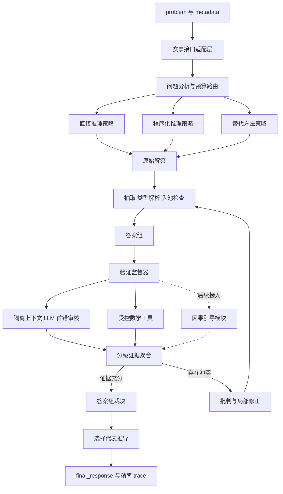

# 因果引导的数学推理智能体——系统方案文档

> 版本：V2.0（终极版）  
> 日期：2026-07-25  
> 用途：挑战杯 2026 人工智能赛道初赛总体方案与后续演进基线  
> 设计依据：当前接口约束、现有代码说明及 Math-Verify、Qwen2.5-Math、ToRA、PRM800K、MATH、DeepSeek-Prover-V1.5、FunSearch 等开源项目的一手资料  
> 提交约束：以赛事最新 AtomGit 作品提交流程为准，评测拉取已关联仓库的 `main` 分支；本文“已实现”仅表示仓库当前代码与测试所覆盖的能力。

## 1. 项目概述

### 1.1 项目名称

**因果引导的数学推理智能体**

### 1.2 项目定位

本项目面向数学问题自动求解场景，建设一个以大语言模型为推理核心、以多策略候选搜索为主要方法、以类型化答案处理和分级验证证据为可靠性基础、以受控数学工具和批判修正闭环提升正确率的数学推理智能体。

系统最终愿景是在常规数学推理能力之上增加“因果引导层”，利用依赖分析、错误根因定位和干预式策略调整指导求解与修复。但因果模块目前尚未实现，现阶段首先完成稳定、可验证、可提交的数学推理主体。

### 1.3 当前状态声明

| 能力 | 当前状态 | 说明 |
| --- | --- | --- |
| 官方评测接口适配 | 已有基础实现 | 已提供 `ReasoningAgent` 和 `solve` |
| 多候选生成 | 已有基础实现 | 当前采用多次采样生成候选 |
| LLM 候选验证 | 已有基础实现 | 当前通过验证器投票选择候选 |
| 答案提取与保守规范化 | 已实现 | 支持嵌套 `\boxed`、中英文标记、选择题与末行回退；支持常见分数、小数和根式的保守规范化 |
| 候选聚类与可审计选择 | 已实现 | 候选显式记录答案、规范答案、证据、验证状态和调用数；当前无受控工具时按共识、审核、固定 ID 决定 |
| 分级证据裁决 | 开发中 | 简单算术可在显式实验开关下产生受控工具证据；默认路径未接入，强反例策略尚无开发集收益证据 |
| 题型分析与动态路由 | 计划实现 | 当前代码尚未实现 |
| 数学工具适配层 | 实验实现 | `sympy_adapter.py` 仅支持白名单算术等价证据，须显式开启且未通过 A/B；Z3、数值执行器、Lean 与 MCP 均未实现 |
| 批判—修正闭环 | 计划实现 | 当前没有错误定位和局部修复 |
| 因果引导模块 | **明确缺失** | 后续补充，当前不参与求解和能力宣传；MCP 仅为可选后端 |
| LangGraph 编排 | 研发扩展 | 不作为初赛提交的前置条件 |
| 服务端与可视化 | 展示扩展 | 不进入最小评测内核 |

## 2. 问题分析

通用大语言模型具备数学文本理解和自然语言推导能力，但单次生成仍存在以下问题：

1. **推理路径单一**：早期错误会沿后续步骤持续传播。
2. **计算结果缺乏外部验证**：复杂代数、约束和枚举容易出现计算错误。
3. **自我验证存在同源偏差**：生成器和验证器可能重复认可同一错误。
4. **答案表达不稳定**：正确结论可能埋在冗长文本中，影响自动判分。
5. **资源利用粗放**：简单题和难题使用相同调用预算，容易浪费或超时。
6. **错误修复缺少定位**：发现冲突后整体重做，无法只修复首个错误。
7. **候选身份与验证状态混淆**：数学上相同的答案可能因文本不同被重复计票，验证结果又可能被误用为答案去重键。
8. **软证据可能覆盖硬反例**：若将共识、LLM 自评和工具结果简单加权，多个弱信号可能抵消一个确定性反例。

本项目采用“分析与预算规划—多策略生成—类型化答案解析—答案组构建—分级证据验证—批判修正—确定性裁决”的闭环方案，在有限预算下提高最终答案的正确性、稳定性与可审计性。

## 3. 建设目标

### 3.1 核心目标

- 满足 `ReasoningAgent(client=official_client)` 初始化方式。
- 每道题独立运行，不依赖执行顺序、跨题状态或隐藏信息。
- 返回可 JSON 序列化且包含非空 `final_response` 的字典。
- 通过互补候选、答案组和分级证据机制提高正确率。
- 控制模型调用次数、token、延迟和异常影响范围。
- 为数学工具适配层和后续因果模块预留稳定接口。

### 3.2 扩展目标

- 规划评估 SymPy、Z3、结构化数值执行器和 Lean 4；除受控 SymPy 实验外，其余尚未实现，研发 Sandbox 也未接入。
- 支持候选冲突检测、首错定位和局部修复。
- 支持离线提示词优化、数据集回归和链路观测。
- 支持演示环境中的推理图和执行过程展示。

### 3.3 非目标

- 初赛阶段不建设通用聊天或知识问答平台。
- 不依赖数据库、Redis、前端或外部常驻服务完成单题求解。
- 不默认使用跨题记忆或长期会话状态。
- 不在因果模块完成前声称系统具备因果推断能力。
- 不为展示冗长 trace 牺牲最终答案的清晰性和正确性。

## 4. 总体设计原则

1. **评测内核优先**：官方只直接调用 `user_agent.py`，先保证入口和求解稳定。
2. **确定性编排优先**：路由、预算、聚合和终止条件尽量使用代码控制。
3. **验证证据优先**：可计算问题优先使用符号、约束或数值工具提供证据。
4. **分层降级**：工具、解析或某个候选失败时退化到简单路径，不让整题失败。
5. **规划与事实分离**：文档和答辩材料严格区分已实现、开发中和规划中能力。
6. **最小必要复杂度**：LangGraph、数据库、前端等在证明必要前不进入评测关键路径。
7. **类型先于比较**：先识别答案类型、精度和定义域，再选择解析器与等价判断方式。
8. **强证据不可被弱证据抵消**：确定性反例优先淘汰；LLM 未发现错误只作为弱支持，不等同于证明正确。
9. **预算先规划后执行**：分析、生成、验证、修复和模型式 Finalizer 共用同一模型调用硬上限。

## 5. 总体架构

系统采用双层架构：竞赛推理内核随仓库提交，在一次 `solve` 调用内完成求解；研发与演示平台用于离线评测、Prompt 优化、链路观测和可视化，不作为评测强依赖。



## 6. 核心模块

### 6.1 赛事接口适配层

- 接收 `problem: str` 和 `metadata: dict`。
- 只依赖公开的 `client.chat(messages, temperature, max_tokens)` 契约。
- 创建单题上下文，不依赖跨题状态。
- 捕获可恢复异常并触发降级。
- 保证返回非空 `final_response`。

### 6.2 问题分析与预算路由

当前实现状态：规则型 L0/L1 路由和局部修正实验开关已实现，但默认关闭；L2/L3 的工具编排、模型式分析器和 Finalizer 仍为规划。默认提交路径保留固定 `3` 次生成和按答案组审核，直到更大冻结集证明动态路由不降低正确率。

问题分析器识别数学领域、答案类型、定义域、整数性、精度、难度和适用工具。规则足够时不额外调用模型；规则无法判断且预算允许时，才使用分析 Prompt。路由器在执行前生成不可超额的阶段调用计划，并选择最少但互补的策略：简单题只运行直接推理；计算或约束题增加程序化策略；高风险题再增加替代方法和修复机会。

### 6.3 多策略候选生成

1. **直接推理**：自然语言推导，适合一般问题。
2. **程序化推理**：把关键计算转为 SymPy、Z3 或结构化数值操作请求。
3. **替代方法**：使用与主路径不同的方法独立求解，降低同源错误。

生成阶段的产物称为“原始解答”，尚未完成答案抽取或入池检查。多策略的目标是方法互补，而不是单纯提高采样数量。如果无法形成真正不同的策略，不为凑数量强制增加候选。同一模型、同一策略的多次采样可以提高覆盖率，但不视为多个统计独立来源。

### 6.4 答案抽取、入池与答案组

当前实现状态：中英文最终答案标记、选择项、末行回退和保守数值规范化已实现；等价判断已采用 `EQUIVALENT` / `NOT_EQUIVALENT` / `UNKNOWN` 三态，`UNKNOWN` 不合并。方程、集合、区间、向量、矩阵目前只有提取回归覆盖，尚无完整类型语义解析。

- 按 `\boxed{...}`、明确的中英文最终答案标记、题型特定选项、末尾独立行的优先级提取最终答案；嵌套花括号必须使用栈或等价的确定性解析，不使用只能匹配一层括号的正则。
- 根据题型分别解析数值、代数表达式、方程、集合、区间、向量、矩阵和选择项，不把所有格式交给同一个宽松解析器。
- 形成包含原始文本、答案类型、规范形式、精度、定义域、解析状态和警告的类型化答案。
- 解析成功或能够安全回退的原始解答才进入候选池；空答案、明显截断和结构错误记录为拒绝样本，不参与答案组支持统计。
- 先按类型化规范键建立答案组；仅在比较结果明确为 `EQUIVALENT` 时合并。比较结果为 `UNKNOWN` 时保持分离。
- 答案组只表示候选结论相同，不表示结论正确。验证状态作为答案组的证据集合保存，不能成为答案身份或去重键。
- 解析失败时保留原答案并标记 `UNCERTAIN`，不得把失败静默转换为某个数学值。

### 6.5 验证监督器

| 验证方式 | 适用问题 | 作用 |
| --- | --- | --- |
| 隔离上下文 LLM 首错审核 | 通用推导和证明 | 定位首个可证实错误；输出 `REFUTED`、`NO_ERROR_FOUND` 或 `UNKNOWN`，同源审核不视为统计独立 |
| SymPy 适配器 | 代数、方程、微积分 | 化简、求解、等价检查 |
| Z3 适配器 | 整数约束、逻辑组合 | 可满足性、反例搜索 |
| 结构化数值执行器 | 数值、枚举、递推、模拟 | 执行白名单化操作并重算；竞赛内核不执行模型生成的任意 Python |
| Lean 4 适配器 | 可形式化证明 | 提供机器可检查证据 |

每条验证证据必须声明验证对象、适用范围、前提假设、执行状态和命题状态。工具成功运行不等于候选正确；例如只验证某个中间等式时，证据范围只能标记为该步骤。自然语言到结构化工具请求的翻译若未经验证，也必须作为显式假设保留。

Lean 4 接入成本较高，初赛阶段作为选择性增强，不作为所有题目的必经节点。

### 6.6 批判与修正闭环

当前实现状态：审核明确失败时的单轮局部修正和复审已作为默认关闭的实验能力实现；多轮影响范围分析与结构化首错类型仍为规划。

当答案组冲突、工具验证失败或证据不足时：

1. 批判器定位第一处可确认错误。
2. 修正器只重写错误及其受影响步骤。
3. 修正后的原始解答重新进入答案抽取、入池、分组和验证。
4. 达到修复次数或预算上限后停止循环。

批判器没有发现错误时只能输出 `NO_ERROR_FOUND`，不能据此声称候选已被证明。局部修正优先于整题重做，以减少 token 消耗和错误扩散。

### 6.7 最终裁决器

最终裁决分为“答案组选择”和“代表推导选择”两步，不使用一个固定加权总分混合所有证据。

答案组选择采用以下优先级：

1. 有适用前提的确定性反例或约束冲突淘汰对应答案组。
2. 覆盖最终目标命题的确定性验证成功者优先。
3. 在没有强证据时，按不同策略支持数、候选覆盖和未解决冲突排序；同策略重复采样单独记录，不冒充独立证据。
4. LLM 的 `NO_ERROR_FOUND`、答案完整度和格式质量只作弱排序信号。
5. 仍同分时按固定答案组 ID 排序，保证可复现。

选定答案组后，从中选择约束完整、未验证假设少、推导简洁且格式稳定的代表解答。输出首先给出明确结论，再提供必要的简洁推导，避免因过长而截断最终答案。

### 6.8 预算与降级

单题设置模型调用硬上限、工具调用上限、最大修复轮数、输出 token 申请上限和软超时。由于公开 `client.chat` 只保证返回字符串，系统不能假定能够获得服务端真实 token 用量；运行时可硬控制模型调用次数和每次 `max_tokens`，对总 token 仅记录申请量或估算量。

路由器必须在执行前生成阶段调用计划，满足：

```text
analysis_calls
+ generation_calls
+ llm_verification_calls
+ repair_calls
+ model_finalizer_calls
<= max_model_calls
```

模型式 Finalizer、补采样和分析 Prompt 都必须提前占用调用槽位；没有槽位时使用代码式 Finalizer、已有候选裁决或固定非空降级响应。工具调用不计入模型调用数，但构造或解释工具请求所需的模型调用仍计入。建议采用分级策略：

| 级别 | 场景 | 策略 |
| --- | --- | --- |
| L0 | 简单且答案明确 | 1 次生成 + 至多 1 次审核；其余槽位不强制使用 |
| L1 | 普通计算或推导 | 2 次互补生成 + 对答案组按需审核；总调用不超过计划 |
| L2 | 高难或候选冲突 | 至多 3 次生成 + 分组后审核 + 工具；为修复或模型式 Finalizer 预留 1 个槽位 |
| L3 | 高价值且适合增强 | 在 L2 硬预算内选择性调用 Lean；因果模块仅通过验收后启用 |

当前基线仍可保留“3 次生成 + 3 次审核 = 6 次调用”作为对照配置，但动态路由上线后不得把该固定配置与分级配置混用。是否减少调用必须通过冻结开发集 A/B 测试决定。

## 7. 因果模块缺失与后续方案

### 7.1 缺失声明

项目名称包含“因果引导”，但初始计划和当前代码均未实现因果算法。现阶段系统实质上是多候选生成、验证和选择的数学推理智能体。

在因果模块完成前：

- 因果能力不进入当前功能清单和性能结论。
- 不用普通路由或相关性评分替代“因果算法”。
- 不展示虚构的因果实验结果。
- 系统运行时不强依赖尚不存在的因果服务。

### 7.2 因果模块定位

后续将因果能力封装为独立工具模块；MCP Server 仅是研发或服务化时的可选后端，而不是竞赛内核前置条件。第一阶段聚焦两类可验证任务：

1. **推理依赖分析**：将题目条件、变量、子结论和最终结论组织为有向依赖图，识别关键及冗余条件。
2. **错误根因分析**：根据失败证据分析错误传播链，定位上游假设、计算或推导错误，建议最小修复干预。

对于因果概率、干预或反事实题，可在后续增加结构因果模型能力；是否进入默认链路需由收益和成本决定。

### 7.3 预留工具

以下名称仅为暂定设计，不代表已经实现：

```text
causal_reasoning_server/
├── extract_dependency_graph
├── identify_critical_assumptions
├── locate_error_root_cause
├── propose_minimal_intervention
├── evaluate_counterfactual
└── validate_causal_chain
```

因果模块接入问题分析和错误修正两个节点，只提供辅助证据，不直接覆盖最终裁决。若后端超时、失败或证据不足，主流程忽略该证据并退化到常规验证路径。

## 8. 竞赛内核与演示平台边界

### 8.1 竞赛提交内核

- `user_agent.py` 入口。
- 确定性编排和数据模型。
- Prompt、候选和答案处理逻辑。
- 必要且可安装的依赖。
- 可选数学工具适配器及降级路径；竞赛内核不执行模型生成的任意 Python，MCP 为研发或服务化后端。
- 简洁、无敏感信息的 trace。

### 8.2 研发与演示平台

- LangGraph：复杂状态图、并行分支和调试回放。
- DSPy：离线优化 Prompt 和推理程序。
- Langfuse：调用链路、token、延迟和实验观测。
- FastAPI：演示 API 和流式事件。
- React + React Flow：展示 Agent Graph 和验证状态。
- PostgreSQL/Redis：实验记录、任务状态和缓存。
- Docker Compose：统一启动演示系统与 MCP Servers。

这些组件不应成为官方评测导入 `user_agent.py` 的必要条件。

## 9. 执行流程

1. 校验输入并创建单题上下文。
2. 识别题型、约束、答案类型和风险级别。
3. 生成阶段级调用计划，选择候选策略和验证方式。
4. 生成互补的原始解答。
5. 抽取并类型化解析最终答案，完成入池检查。
6. 按规范答案建立答案组，无法确认等价的答案保持分离。
7. 优先验证答案组和关键分歧，调用 LLM 首错审核及适用数学工具。
8. 聚合带范围和假设的分级证据，检测强反例与未解决冲突。
9. 必要且预算充足时定位错误、局部修正，并重新进入解析、分组和验证。
10. 按证据优先级选择答案组和代表推导。
11. 使用代码式或已预留调用槽位的模型式 Finalizer 生成明确、简洁的 `final_response`。
12. 输出必要 trace 摘要，不保存完整 Prompt、模型原始输出或敏感信息。

## 10. 非功能要求

### 10.1 正确性与稳定性

- 等价比较返回 `EQUIVALENT`、`NOT_EQUIVALENT` 或 `UNKNOWN`，并满足既定答案类型下的对称比较约束。
- 工具结果分别记录执行成功与否、命题是否被支持、证据范围和前提假设。
- 单个候选或工具失败不能导致整个批次中断。
- 所有循环、重试和调用都有预算上限。
- 强反例不能被多个弱分数抵消。

### 10.2 可复现性与安全

- 所有代码、Prompt 和资源通过仓库相对路径访问。
- 所有运行依赖在依赖文件中声明。
- 不依赖私有 client 字段、开发机路径或未声明服务。
- 不硬编码 API key，不读取隐藏测试或标准答案。
- 竞赛内核仅允许白名单化的结构化数学操作；研发环境中的代码执行限制网络、文件、子进程、动态安装、内存、输出长度和执行时间。

### 10.3 资源效率

- 简单题避免固定运行全部 Agent。
- 工具结果在单题上下文内复用。
- 修复采用局部修改而非无条件重新生成。
- 为最终裁决保留必要 token。
- 对答案组而非每条重复候选进行审核，避免等价候选重复消耗调用预算。

## 11. 分阶段建设路线

### 阶段一：稳定提交基线

- 支持嵌套 `\boxed`、中英最终答案标记、选择题和末行回退。
- 建立类型化答案、保守规范化、三态等价判断和答案组。
- 缩减 trace 中的完整 Prompt 与冗长输出。
- 增加异常降级和空结果保护。
- 建立接口、预算不变量、解析性质和样例回归测试。

### 阶段二：模块化推理内核

- 增加问题分析、动态预算和策略路由。
- 解耦直接推理、程序化推理和替代策略。
- 增加分级证据聚合、答案组裁决和代表推导选择。

### 阶段三：神经符号工具

- 优先接入 SymPy 和结构化数值执行器。
- 根据题型收益接入 Z3。
- 评估覆盖率与部署成本后再接入 Lean 4。

### 阶段四：批判修正闭环

- 实现首错定位、局部修正和复验。
- 建立错误类型数据集和修复效果指标。

### 阶段五：因果模块

- 明确定义“因果引导”的可验证任务。
- 实现依赖图、根因定位和最小干预建议。
- 通过无因果、普通批判器、因果根因分析三组消融实验验证增益。
- 取得稳定收益后才纳入默认求解链路。

### 阶段六：研发与展示平台

- 接入 LangGraph、Langfuse 和离线评测。
- 建设 FastAPI 与 React Flow 演示界面。
- 使用 Docker Compose 部署非评测服务。

## 12. 风险与应对

| 风险 | 影响 | 应对 |
| --- | --- | --- |
| 模型调用过多 | 超时、限流 | 动态预算、早停、简单题单路由 |
| 验证器同源偏差 | 错误候选获高分 | 方法互补、答案组、首错审核和受控工具证据 |
| 等价判断不对称或过度归一化 | 错误合并答案组 | 类型化解析、三态比较、双向确认和不确定不合并 |
| 弱证据覆盖强反例 | 错误答案被加权总分选中 | 采用证据优先级，确定性反例先淘汰 |
| 工具后端不可用 | 工具链失效 | 进程内适配和无工具降级 |
| Python 权限过大 | 安全风险 | 竞赛内核只开放结构化操作；研发 Sandbox 单独隔离 |
| Lean 覆盖率低 | 投入高、收益小 | 仅用于适合题型，后置建设 |
| 因果定义不清 | 创新点难落地 | 先定义任务和指标，再实现算法 |
| 过度平台化 | 偏离评分目标 | 内核与演示平台严格分层 |

## 13. 验收标准

### 13.1 初赛提交验收

- 根目录存在 `user_agent.py`。
- `ReasoningAgent(client=official_client)` 可初始化。
- `solve(problem, metadata)` 可独立执行。
- 返回值可 JSON 序列化且含非空 `final_response`。
- 不使用样例 `answer` 字段或隐藏评测信息。
- 不依赖绝对路径、私有 client 字段和本地常驻服务。
- 单题失败不影响其他题目。
- 任一执行路径的模型调用数不超过硬上限；无剩余调用时仍能通过代码路径生成非空响应。

### 13.2 能力阶段验收

- 每个新增模块有明确输入、输出、失败状态和降级路径。
- 在冻结开发集上记录最终正确率、平均模型调用数、平均 token、平均延迟、超时率、空结果率和解析失败率，并以单次直接生成作为基线。
- 答案解析测试覆盖嵌套 `\boxed`、分数、小数、方程、集合、区间、向量、矩阵和选择题；解析失败不得篡改原答案。
- 等价判断具备三态结果、超时保护和对称性性质测试；近似判断不通过普通传递闭包强制聚类。
- 裁决测试证明确定性反例不会被候选数量或 LLM 弱支持抵消。
- 预算测试覆盖分析、补采样、验证、修复和 Finalizer 的所有路径。
- 对多候选、工具验证、批判修正和因果模块分别进行消融；只有收益相对成本可复现时才进入默认路径。
- 工具接入通过实验验证收益大于成本。
- 因果模块有独立测试与对照实验，未通过前保持“规划中”。
- 文档的实现状态与代码、测试和演示结果一致。

## 14. 结论

本项目采用分层、可验证、可降级的建设路线。竞赛内核以阶段预算为约束，以互补策略产生原始解答，以类型化解析和答案组消除表达噪声，以分级证据和确定性反例优先规则完成裁决，并在预算允许时进行首错定位和局部修正。

开源项目仅提供经过边界裁剪的工程参考：Math-Verify 和 Qwen2.5-Math 用于答案处理设计，ToRA 用于受控工具交互，PRM800K 用于首错审核语义，DeepSeek-Prover-V1.5 和 FunSearch 用于预算、证据与候选管理纪律；不照搬其训练栈、大规模搜索或未开源的 Sandbox。

因果部分作为后续创新模块，以独立工具接口接入；MCP Server 可作为研发或服务化后端。目前该部分明确缺失，不参与现阶段能力声明。后续必须通过可复现的消融实验验证因果依赖分析和错误根因定位的实际增益，再决定其在默认流程中的位置。
