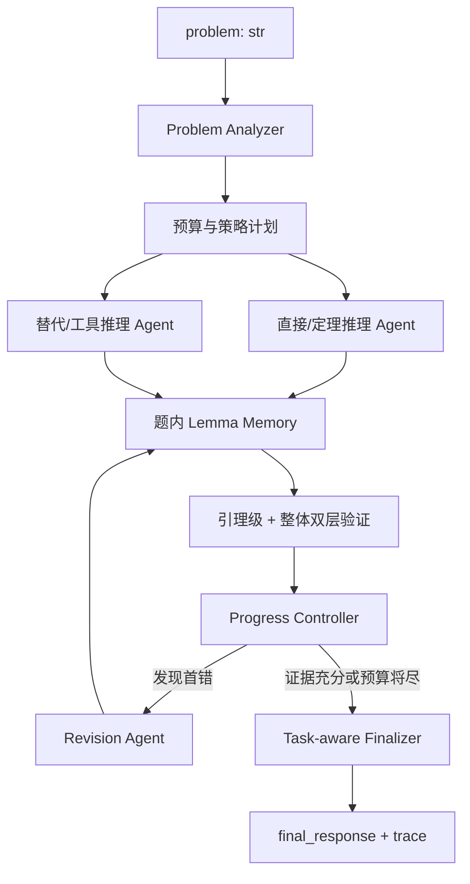

# 数学推理智能体系统方案

> 版本基线：当前提交前工作区
>
> 验证状态：安装已声明依赖后，139 项测试全部通过
>
> 方案主线：**题型识别 → 互补策略求解 → 合并式逐步与完整性验证 → 单轮定点修正 → 复验回滚 → 按题型输出**
>
> 状态说明：本文严格区分当前已实现能力与后续设计，不将规划能力宣称为已完成。

## 一、当前仓库最值得保留的部分

当前 `user_agent.py` 已经具备：

- 稳定的 `ReasoningAgent(client=...)` 与 `solve(problem, metadata)` 接口。
- 单题模型调用硬预算。
- 3 个候选生成、答案分组和按组审核。
- 分数、多根答案的保守规范化。
- `EQUIVALENT` / `NOT_EQUIVALENT` / `UNKNOWN` 三态等价判断。
- 紧凑、不泄露完整 Prompt 和模型原文的 `trace`。
- SymPy 受控实验适配器。

历史基线（已退役的 23 题开发集）：两轮 15/23、18/23，平均约 71.7%。该数据只能表示旧开发集基础入口链路的表现，不能外推为比赛能力估计。当前默认本地集合已切换为 112 题短题知识覆盖集（`sample_data/public_regression_112.jsonl`）；它覆盖 18 个方向，但 112/112 均被当前分类器识别为 `calculation`。

因此，后续不推倒重写，保留入口、预算器、答案规范化、答案组和证据优先裁决。

## 二、2026-07-30 审计后的五个主要问题

### 1. 复杂题型证据缺失

112 题覆盖 18 个知识方向，但 `classify_problem_type` 的实测分布为
`calculation=112`，其余五类为 0。它可以检查知识面、答案解析和基础链路，
不能证明证明/推导/解释、长题面、跨方向混合题、多解、反例和存在性问题能力。
后续需要与 RAG 语料隔离、禁止逐题调 Prompt 的复杂能力冻结集。

### 2. P2 默认晋升缺少同窗 A/B

异构 Reasoner 已实现并在当前默认配置中开启，但尚无同一评测窗口下“同 Prompt
三采样 vs 异构 Reasoner”的至少双轮结果。旧 23 题产物已退役但可从 Git 历史
追溯；这不是证据永久丢失，而是迁移 Gate 与模型效果 Gate 曾被混淆。

### 3. P3 修正存在 fail-open

当前修正答案在复验 `skipped`、`inconclusive` 或无剩余预算时仍会被保留。
正式开启修正前必须改为 fail-closed：只有复验明确通过或确定性工具明确支持时
接受修正，其余状态回滚原答案。

### 4. evaluator 不足以支撑消融

当前 evaluator 缺少异构/P3 显式 CLI 开关、P3 状态统计、有效调用上限、P95、
配置版本和可离线重判的紧凑预测答案；`within_call_cap` 仍按基础 6 次判断，且
本地评分只是近似字符串一致。应先补齐这些能力，再做默认路径晋升。

### 5. 工具与 RAG 尚无收益证据

LangGraph、AgentScope 和 Lean 4 不进入正式链路仍是正确边界。确定性数学工具和
离线定理卡值得实验，但应先用普通 Python gateway 与 20–40 张卡片做小规模消融；
MCP 只是可选传输层，100–200 张卡片和依赖引导 DAG 都不能在无证据时直接默认。

## 三、18 个方向压缩为 5 个求解策略家族

18 个方向不设计成 18 个 Agent。`subject` 只能用于本地统计，正式运行时根据 `problem: str` 进行多标签判断。

| 策略家族 | 包含方向 | 数量 | 主要能力 |
| --- | --- | ---: | --- |
| 离散—代数—优化 | 离散数学、抽象代数、高等代数、运筹学 | 34 | 构造、计数、归纳、反证、枚举、有限结构 |
| 连续纯数学 | 测度积分、微分几何、复分析、泛函分析、数学分析、拓扑学 | 33 | 定义与定理条件、严格证明、反例、局部坐标计算 |
| 数值—微分方程 | 数值分析、常微分方程、偏微分方程 | 21 | 算法推导、误差分析、残差验证、边界条件检查 |
| 概率—统计 | 概率论、随机过程、统计推断、线性回归 | 22 | 建模假设、分布计算、期望方差、估计量性质 |
| 通用高级 | 非基础及进阶课程 | 2 | 通用双策略和高风险验证 |

这样既覆盖混合方向，也不会因为某些方向只有 1 题而过拟合。

前 8 个方向占 77.68% 的比例只适合用于：

- RAG 资料建设优先级。
- 本地评测采样权重。
- 研发资源分配依据。

不得在正式运行时将该比例或 `metadata.subject` 当作题目学科先验。

## 四、Intern-S1-MO 化目标架构



### 1. Problem Analyzer

只从题面识别：

```python
ProblemProfile(
    domains=["probability", "measure_theory"],
    task_type="proof",
    answer_type="proposition",
    risk_level="high",
    applicable_tools=["rag", "symbolic_check"],
)
```

允许多标签，不依赖 `metadata` 中的 `subject`。优先使用规则分析；规则不确定且预算允许时，才调用一次模型分析器。

### 2. Parallel Reasoners

不再依赖同 Prompt 随机采样，而是强制不同策略：

- `DirectReasoner`：定义、定理、标准推导。
- `AlternativeReasoner`：反证、构造、特殊情形、边界检查、程序化验证。
- 只有高风险题才增加第三策略。

“多 Agent”在这里指逻辑角色隔离，正式提交不需要引入 LangGraph 或 AgentScope；轻量 Python 状态机更适合 Docker 评测。

### 3. P3-lite 题内验证

P3-lite 在单次 `solve` 内对选中解答执行一次合并验证，不跨题保存状态，也不抽取结构化引理或隐藏思维链。验证器在同一次调用中：

- 逐步检查定义域、定理条件、等式变换和遗漏情形。
- 定位第一个明确错误并给出简短原因。
- 检查是否真正回答题目、证明是否闭合、是否覆盖全部情况，以及最终答案是否与推导一致。
- 只有输出完整终止标记时才视为有效验证；畸形或截断输出记为 `inconclusive`。

该简化路线避免依赖不稳定的结构化引理抽取。更细粒度的依赖图和工具证据属于后续研究范围，不作为当前 P3-lite 已实现能力。

### 4. 合并式验证状态

验证结果分为三类：

- `ok`：收到完整协议，且可记录明确错误、遗漏或完整通过。
- `inconclusive`：模型输出畸形、截断或缺少终止标记，不触发修正。
- `skipped`：调用预算耗尽、超时或 client 调用失败。

### 5. Revision Agent

修正器只接收：

- 原题。
- 原解答。
- 第一个错误步骤与原因。
- 整体检查发现的遗漏。

修正最多执行一轮。修正文本无法抽取答案时拒绝；复验明确发现错误或遗漏时已能
回滚到原答案。2026-07-30 审计确认尚有 fail-open：复验 `skipped`、
`inconclusive` 或无剩余预算时当前实现仍保留修正。正式开启修正前必须改为
fail-closed，只有复验明确通过或确定性工具明确支持时接受。启用 P3-lite 时额外
预留 3 次调用，覆盖验证、修正和复验。

## 五、动态预算设计

当前已有动态预算实验只识别简单算术，它的失败不能证明真正的题型动态预算无效。

| 路由 | 场景 | 模型调用计划 | 单次输出预算 |
| --- | --- | --- | ---: |
| L0 | 选择、填空、简单计算 | 1 次求解；工具可验证时直接结束，否则增加 1 次审核 | 768–1024 |
| L1 | 常规计算、标准推导 | 2 个互补 Reasoner + 工具 / 按组审核 | 1536–2048 |
| L2 | 证明、解释、混合方向、候选冲突 | 2 Reasoner + 引理整理 + 验证 + 可选修正 + 最终检查 | 2048–4096 |

表中分题型 token 区间是待验证假设，不是当前默认配置。当前生成上限仍为 1024；
历史上 4096 请求出现过明显延迟/超时，任何 1536–4096 晋升都必须在复杂能力集上
单变量 A/B，并同时满足 P95 延迟和超时 Gate。

初期仍将模型硬上限保持在 6 次，只改变调用用途。同时：

- 用 `time.monotonic()` 记录单题耗时。
- 约 16 分钟进入收敛阶段。
- 约 18 分钟后不再发起新调用。
- 最终输出由代码完成，不将最后一次模型调用作为必需步骤。

模型“思考模式”由平台选择的 reasoning 模型提供，仍只调用公开契约：

```python
client.chat(messages, temperature, max_tokens)
```

不自行添加 `thinking=True` 等官方 client 未承诺支持的参数，也不把隐藏思考过程写入 `trace`。

## 六、受控本地工具与离线 RAG

### 1. 工具 gateway 与可选 stdio MCP

工具能力先实现为普通 Python 函数并通过统一 gateway 调用，以便单测、超时控制和
失败降级。只有协议隔离确有收益时，才增加仓库内置 stdio MCP 适配；不使用 HTTP，
不占用固定端口：

```text
agent_core/tools/mcp_server/
    server.py
    sympy_tools.py
    numeric_tools.py
    enumeration_tools.py
    retrieval_tools.py
```

首批工具：

```text
retrieve_math_cards
check_symbolic_equivalence
solve_or_verify_equation
evaluate_numeric_expression
enumerate_finite_cases
```

运行约束：

- 直接 gateway 为正式路径的最小实现；MCP 适配通过 `sys.executable -m ...` 和仓库相对路径启动。
- 每个 `ReasoningAgent` 进程拥有自己的 stdio server。
- 不写共享状态，不使用固定端口。
- gateway/MCP 启动或调用失败时降级到普通模型推理。
- 禁止执行模型生成的任意 Python。
- 所有工具限制输入长度、复杂度、执行时间和输出长度。

### 2. 离线 RAG

18 个方向更适合“定理卡片库”，而不是将整本教材放入索引。每张卡片包含：

- 领域。
- 触发关键词 / LaTeX 特征。
- 定义与定理。
- 使用条件。
- 常见证明骨架。
- 常见反例和易错条件。
- 可使用的工具验证方法。
- 资料来源。

优先使用纯离线 BM25 或 SQLite FTS5：

- 对中文词、数学专名和 LaTeX 符号共同分词。
- 不需要 embedding 模型或 GPU。
- 不在运行时下载权重。
- 索引随仓库提交。
- 每题只取 Top 2–4 张卡片，总长度控制在约 1500 token 内。

必须区分：

- `Working Lemma Memory`：当前题临时生成的已验证引理。
- `Offline RAG Library`：预先整理的静态数学知识卡片。

## 七、实施顺序

### P0：修正输出与规则冲突

- 实现 task-aware `final_response`。
- 更正文档中的 20 分钟和 Lean 限制。
- 证明题不再因无法抽取一个数值答案而被拒绝。

### P1：建立 18 方向短题知识覆盖集

- 按公开的 18 方向分布冻结 112 道可追溯回归题；题面与答案必须有明确公开来源或由本项目独立审校，不得把第三方原创集合冒充官方 samples。
- `subject` / `answer` 只保留在 evaluator，绝不传入 `solve`。
- 在迁移验收期间，当前 23 题仅用于新旧评测链路双轨对照。
- 输出总体、5 大家族、18 方向和题型宏平均结果。

截至 2026-07-30，P1.5 的数据/接口/资产迁移 Gate 已完成：112 题数据校验、
evaluator 隔离与端到端冒烟均通过（13/13 测试 + 3 项 smoke）。该 Gate 不是
模型双轮效果 Gate；112 题均为分类器意义上的 `calculation`。旧 23 题资产已
退役，历史通过 Git 追溯。详见 `docs/p1_5/p1_5_migration_summary.md`。

### P1.5：旧评测资产退役 ✅（2026-07-30 完成）

- `sample_data/dev.jsonl` 缩减为官方 3 道题（smoke test）。
- 112 题为独立冻结回归集；`evaluate_dev.py` 和 `scan_budget.py` 默认运行该集合。
- 删除旧 20 道手工题、baselines（25 文件）、diagnosis、budget_scan（25 文件）、实验 JSON 等。保留决策摘要报告。
- 迁移摘要：`docs/p1_5/p1_5_migration_summary.md`；历史通过 Git 追溯。

### P2：用 2 个互补 Reasoner 替代 3 次同 Prompt

- 该阶段先不增加 Lemma Memory。
- 实现已完成；默认晋升仍需至少双轮验证“策略差异”是否优于随机采样。

### P3：逐步验证 + 整体检查 + 单轮修正（实现验收通过，效果待验）

- 实现路线：P3-lite。放弃 LemmaRecord 结构化抽取（InternLM 强制 Thinking Process 不可靠），改为单次合并验证。
- `_verify_solution()`：逐步检查 + 完整性评估合并为一次调用。
- `_revise_with_guidance()`：仅当修正文本可抽取非空答案时进入待接受状态；修正后复验。
- 预算预留：`p3_call_boost=3`，覆盖最坏路径中的验证、修正和复验。
- 当前后台参考评测临时开启 `enable_step_verification`、关闭 `enable_step_revision`；验证发生在选中答案之后，不改变最终答案，只能观测开销。
- 正式开启修正前修复复验 fail-open，并补齐 evaluator 的 P3 状态统计。

### P3.1：补齐评测与复杂能力 Gate

- evaluator 暴露同 Prompt/异构/P3 验证/P3 修正的显式配置，记录有效调用上限、P95、P3 状态和 Judge 覆盖率。
- 建立独立复杂能力冻结集，覆盖六题型、长条件和跨方向混合题，且不得进入 RAG 或用于逐题调 Prompt。
- 对 A 同 Prompt、B 异构、C 异构+验证、D 异构+验证+修正执行至少双轮 A/B，再决定正式默认路径。

### P4：受控本地工具和离线 RAG

- 先实现普通 Python gateway 与三个确定性工具；MCP 只作为可选 stdio 适配层。
- 先用 20–40 张定理卡验证 SQLite FTS5/BM25 的检索覆盖和净收益，再决定是否扩容。
- 分别进行无工具 / 工具 / RAG / 工具 + RAG 消融。
- 没有可复现额外收益的工具不进入默认链路。

### P5：再发展因果引导

- 将引理依赖 DAG 用于错误根因定位和受影响范围计算。
- 在证明稳定收益前，只称为“依赖引导修正”，不提前宣称为真正因果推断。

## 八、当前优先级

如果现在只做三件事，按以下顺序执行：

1. 让当前“异构 + P3 验证、无修正”参考评测完成，但不把它解释为 P3 正确率收益。
2. 修复 P3 fail-open 和 evaluator 配置/判分/成本统计，建立复杂能力冻结集。
3. 完成四组双轮 A/B，决定 P2/P3 默认值；之后才进入工具、RAG 和进一步模块化。

这三项优先于堆叠大型 multi-agent 框架、批量建设定理卡或恢复结构化引理 DAG。
