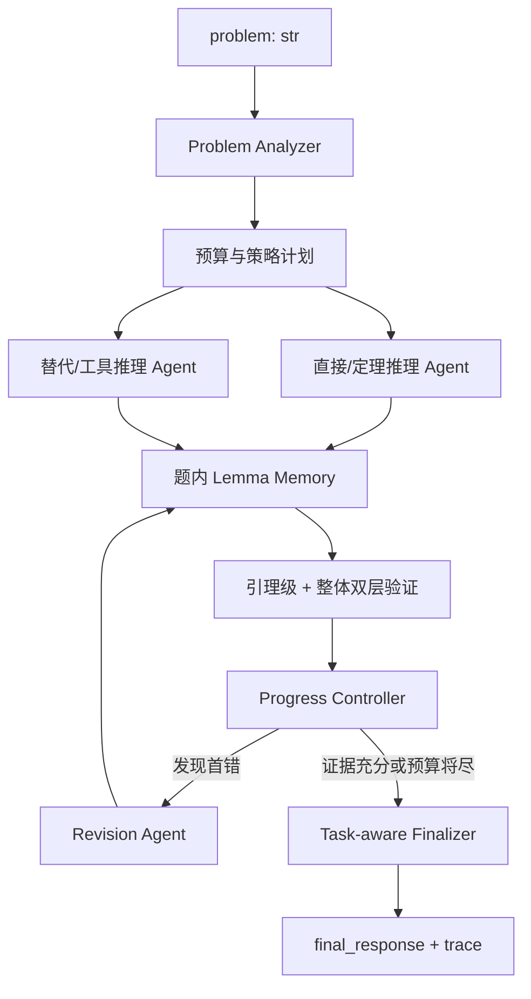

# 数学推理智能体系统方案

> 版本基线：`main` 最新提交 `7980b6b`
>
> 验证状态：安装已声明依赖后，76 项测试全部通过
>
> 方案主线：**题型识别 → 互补策略求解 → 题内引理记忆 → 引理级验证 → 整体解答验证 → 定点修正 → 按题型输出**
>
> 状态说明：本文严格区分当前已实现能力与后续设计，不将规划能力宣称为已完成。

## 一、当前仓库最值得保留的部分

当前 `user_agent.py` 已经具备：

- 稳定的 `ReasoningAgent(client=...)` 与 `solve(problem, metadata)` 接口。
- 单题模型调用硬预算。
- 3 个候选生成、答案分组和按组审核。
- 分数、多根答案的保守规范化。
- `EQUIVALENT` / `NOT_EQUIVALENT` / `UNKNOWN` 三态等价判断。
- 紧凑、不泄露完整 Prompt 和模型原文的 `trace`。
- SymPy 受控实验适配器。

当前报告记录两轮 15/23、18/23，平均约 71.7%。该数据只能表示当前 23 题开发集上的表现，不能外推为比赛能力估计。

因此，后续不推倒重写，保留入口、预算器、答案规范化、答案组和证据优先裁决。

## 二、目前最严重的五个问题

### 1. `final_response` 会丢掉证明过程

当前最终返回逻辑是：

```python
final_answer = best.get("normalized_answer") or best["answer"]
return {"final_response": final_answer, "trace": trace}
```

这对选择题、填空题很合适，但证明、解释、推导题可能只剩下“成立”“0”“证毕”等结果。而最新规则要求：

- 证明题保留必要且完整的证明。
- 推导题保留关键步骤。
- judger 会同时读取 `final_response` 和 `trace`。

这是当前最高优先级问题。系统应先识别：

```text
choice | fill_blank | calculation | derivation | proof | explanation
```

并分别输出：

| 题型 | `final_response` 要求 |
| --- | --- |
| 选择 / 填空 | 规范化答案 |
| 计算 | 简洁计算步骤 + 最终答案 |
| 推导 | 关键推导链 + 最终结果 |
| 证明 / 解释 | 完整但紧凑的选中解答，不能只返回抽取答案 |

`trace` 仍然只保留摘要，真正用于判分的证明和关键推导必须放在 `final_response`。

### 2. 3 次采样不等于 3 种思维

当前三个候选使用同一个 Prompt，只通过温度采样产生差异，本质上是“同一方法 × 3”，而不是：

- 定义 / 定理直接推导。
- 构造、枚举或程序化验证。
- 反证、反例或替代方法。

既有预算扫描表明，单纯把采样次数从 2 增加到 12 没有稳定收益。当前瓶颈不是“候选不够多”，而是“候选不够异质”。

### 3. 当前开发集不能证明高级数学能力

`sample_data/dev.jsonl` 只有 23 题：

- 3 道较正式的高级样例。
- 20 道手工基础题，包括算术、二次方程、面积、点积等。

因此，约 72% 更接近“基础入口链路正确率”，不是 18 个高级数学方向上的比赛能力估计。

### 4. 验证仍然是同源弱验证

生成器和验证器使用同一模型，当前验证只输出：

```text
VERDICT: A / B / UNCERTAIN
```

它不知道错误位于哪个引理、哪些后续步骤需要重算，也无法复用已验证正确的前置结论。

### 5. 文档与最新规则冲突

统一按以下口径执行：

- 单题时间上限为 **20 分钟**；不再声称“赛事无时间限制”。
- Lean 4 只能用于本地研究，不能进入正式 `solve` 执行链，不应出现在正式 `requirements.txt` 中。

## 三、18 个方向压缩为 5 个求解策略家族

18 个方向不设计成 18 个 Agent。`subject` 只能用于本地统计，正式运行时根据 `problem: str` 进行多标签判断。

| 策略家族 | 包含方向 | 数量 | 主要能力 |
| --- | --- | ---: | --- |
| 离散—代数—优化 | 离散数学、抽象代数、高等代数、运筹学 | 34 | 构造、计数、归纳、反证、枚举、有限结构 |
| 连续纯数学 | 测度积分、微分几何、复分析、泛函分析、数学分析、拓扑学 | 33 | 定义与定理条件、严格证明、反例、局部坐标计算 |
| 数值—微分方程 | 数值分析、常微分方程、偏微分方程 | 21 | 算法推导、误差分析、残差验证、边界条件检查 |
| 概率—统计 | 概率论、随机过程、统计推断、线性回归 | 22 | 建模假设、分布计算、期望方差、估计量性质 |
| 通用高级 | 非基础及进阶课程 | 2 | 通用双策略和高风险验证 |

这样既覆盖混合方向，也不会因为某些方向只有 1 题而过拟合。

前 8 个方向占 77.68% 的比例只适合用于：

- RAG 资料建设优先级。
- 本地评测采样权重。
- 研发资源分配依据。

不得在正式运行时将该比例或 `metadata.subject` 当作题目学科先验。

## 四、Intern-S1-MO 化目标架构



### 1. Problem Analyzer

只从题面识别：

```python
ProblemProfile(
    domains=["probability", "measure_theory"],
    task_type="proof",
    answer_type="proposition",
    risk_level="high",
    applicable_tools=["rag", "symbolic_check"],
)
```

允许多标签，不依赖 `metadata` 中的 `subject`。优先使用规则分析；规则不确定且预算允许时，才调用一次模型分析器。

### 2. Parallel Reasoners

不再依赖同 Prompt 随机采样，而是强制不同策略：

- `DirectReasoner`：定义、定理、标准推导。
- `AlternativeReasoner`：反证、构造、特殊情形、边界检查、程序化验证。
- 只有高风险题才增加第三策略。

“多 Agent”在这里指逻辑角色隔离，正式提交不需要引入 LangGraph 或 AgentScope；轻量 Python 状态机更适合 Docker 评测。

### 3. 题内 Lemma Memory

这是一次 `solve` 内的工作记忆，不是跨题记忆：

```python
LemmaRecord(
    lemma_id="L3",
    statement="...",
    dependencies=["L1", "L2"],
    status="SUPPORTED",
    evidence_refs=["sympy:2", "verifier:1"],
    assumptions=["x > 0"],
)
```

它只保存压缩后的关键命题和依赖，不保存完整隐藏思维链。主要作用是：

- 不让验证器反复读取整篇解答。
- 发现首错后只重算其后继步骤。
- 两个候选共享同一正确引理时复用验证结果。
- 为后续“依赖引导修正”提供推导依赖图基础。

### 4. 双层验证

第一层是引理级验证：

- 检查定义域、定理条件、等式变换和遗漏情形。
- SymPy、本地数值工具和枚举器提供确定性证据。
- LLM 定位第一个无法成立或尚未证明的引理。

第二层是整体解答验证：

- 是否真正回答题目。
- 证明是否闭合。
- 是否覆盖全部情况。
- 最终答案是否与推导一致。
- 选择题选项是否与计算结论一致。

### 5. Revision Agent

只接收：

- 原题。
- 已验证引理。
- 第一个错误引理。
- 错误证据。
- 受影响的下游引理。

不让修正器无条件重做整题。修正后重新进入引理验证和整体验证，最多一轮。

## 五、动态预算设计

当前已有动态预算实验只识别简单算术，它的失败不能证明真正的题型动态预算无效。

| 路由 | 场景 | 模型调用计划 | 单次输出预算 |
| --- | --- | --- | ---: |
| L0 | 选择、填空、简单计算 | 1 次求解；工具可验证时直接结束，否则增加 1 次审核 | 768–1024 |
| L1 | 常规计算、标准推导 | 2 个互补 Reasoner + 工具 / 按组审核 | 1536–2048 |
| L2 | 证明、解释、混合方向、候选冲突 | 2 Reasoner + 引理整理 + 验证 + 可选修正 + 最终检查 | 2048–4096 |

初期仍将模型硬上限保持在 6 次，只改变调用用途。同时：

- 用 `time.monotonic()` 记录单题耗时。
- 约 16 分钟进入收敛阶段。
- 约 18 分钟后不再发起新调用。
- 最终输出由代码完成，不将最后一次模型调用作为必需步骤。

模型“思考模式”由平台选择的 reasoning 模型提供，仍只调用公开契约：

```python
client.chat(messages, temperature, max_tokens)
```

不自行添加 `thinking=True` 等官方 client 未承诺支持的参数，也不把隐藏思考过程写入 `trace`。

## 六、本地离线 MCP 与 RAG

### 1. 离线 MCP

使用仓库内置的 stdio MCP，不使用 HTTP，不占用固定端口：

```text
agent_core/tools/mcp_server/
    server.py
    sympy_tools.py
    numeric_tools.py
    enumeration_tools.py
    retrieval_tools.py
```

首批工具：

```text
retrieve_math_cards
check_symbolic_equivalence
solve_or_verify_equation
evaluate_numeric_expression
enumerate_finite_cases
```

运行约束：

- 通过 `sys.executable -m ...` 和仓库相对路径启动。
- 每个 `ReasoningAgent` 进程拥有自己的 stdio server。
- 不写共享状态，不使用固定端口。
- MCP 启动或调用失败时降级到普通模型推理。
- 禁止执行模型生成的任意 Python。
- 所有工具限制输入长度、复杂度、执行时间和输出长度。

### 2. 离线 RAG

18 个方向更适合“定理卡片库”，而不是将整本教材放入索引。每张卡片包含：

- 领域。
- 触发关键词 / LaTeX 特征。
- 定义与定理。
- 使用条件。
- 常见证明骨架。
- 常见反例和易错条件。
- 可使用的工具验证方法。
- 资料来源。

优先使用纯离线 BM25 或 SQLite FTS5：

- 对中文词、数学专名和 LaTeX 符号共同分词。
- 不需要 embedding 模型或 GPU。
- 不在运行时下载权重。
- 索引随仓库提交。
- 每题只取 Top 2–4 张卡片，总长度控制在约 1500 token 内。

必须区分：

- `Working Lemma Memory`：当前题临时生成的已验证引理。
- `Offline RAG Library`：预先整理的静态数学知识卡片。

## 七、实施顺序

### P0：修正输出与规则冲突

- 实现 task-aware `final_response`。
- 更正文档中的 20 分钟和 Lean 限制。
- 证明题不再因无法抽取一个数值答案而被拒绝。

### P1：建立真正评测集

- 将 112 道公开 samples 冻结为回归集。
- `subject` / `answer` 只保留在 evaluator，绝不传入 `solve`。
- 在迁移验收期间，当前 23 题仅用于新旧评测链路双轨对照。
- 输出总体、5 大家族、18 方向和题型宏平均结果。

### P1.5：旧评测资产退役

只有在 112 题回归集的数据校验、evaluator 隔离、完整运行和可复现性验收全部通过后，才执行清理：

- 将 `sample_data/dev.jsonl` 缩减为官方 3 道题，仅用于快速 smoke test。
- 将 112 道公开题保存为独立、冻结的正式回归集，不与 3 题 smoke test 混用。
- 删除旧 23 题中的 20 道手工基础题，以及不再被新评测链路引用的临时数据集、逐轮 JSON、调试报告和废弃实验产物。
- 若官方样例风格压力集未并入 112 题回归集，同步退役其数据、计划和运行产物，避免存在第二套评分口径。
- 只保留一份简短迁移摘要，记录删除范围、新基线、验收结果和替代路径；更详细的历史由 Git 追溯。
- 同步修改评测脚本默认路径、测试、README、TODO 和开发记录，并全仓检查旧 23 题基线与已删文件的残留引用。

清理不得提前执行。如果新评测链路尚未稳定，必须保留旧 23 题和必要对照产物，直到迁移 Gate 通过。

### P2：用 2 个互补 Reasoner 替代 3 次同 Prompt

- 该阶段先不增加 Lemma Memory。
- 独立验证“策略差异”是否优于随机采样。

### P3：加入题内引理记忆、首错验证和单轮修正

- 比较 baseline、Lemma、Lemma + Revision 三组。
- 记录引理验证覆盖率和修正成功率。

### P4：加入离线 MCP 和 RAG

- 分别进行无工具 / MCP / RAG / MCP + RAG 消融。
- 没有可复现额外收益的工具不进入默认链路。

### P5：再发展因果引导

- 将引理依赖 DAG 用于错误根因定位和受影响范围计算。
- 在证明稳定收益前，只称为“依赖引导修正”，不提前宣称为真正因果推断。

## 八、当前优先级

如果现在只做三件事，按以下顺序执行：

1. 修复证明题输出。
2. 用 112 题重建评测，通过迁移验收后退役旧评测资产，只保留官方 3 题作为 smoke test。
3. 用两个异质 Reasoner 替换三个同质采样。

这三项优先于堆叠大型 multi-agent 框架，也更可能直接提高正式评测分数。
